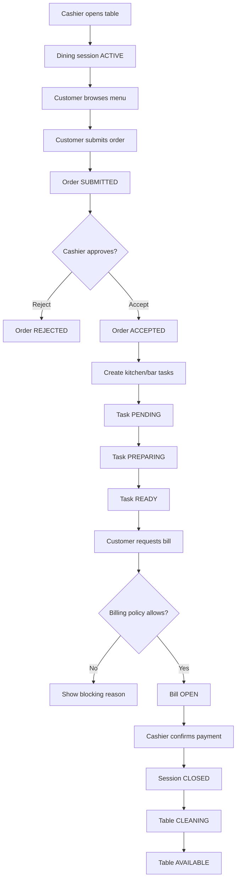
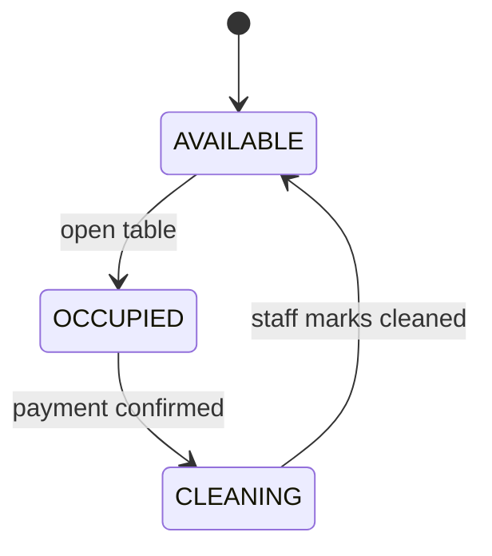
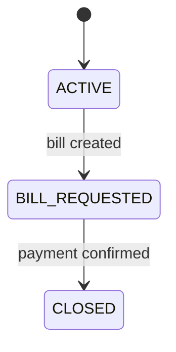
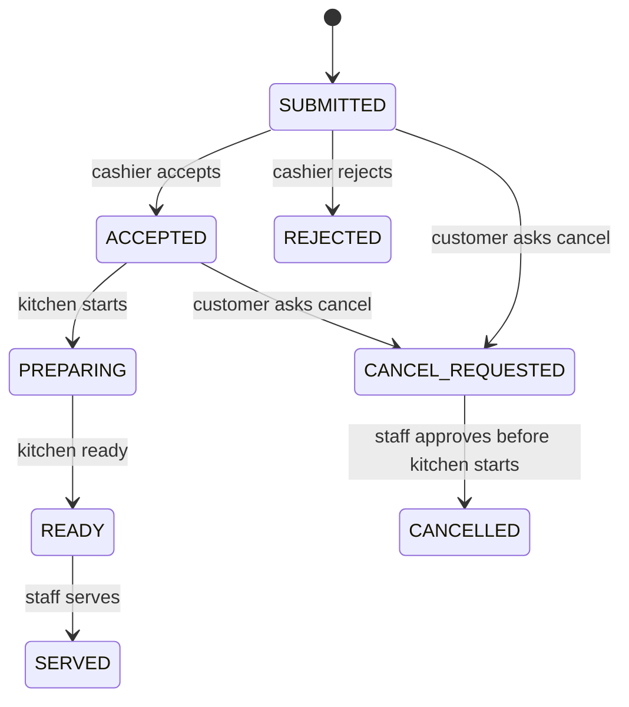

# Core Business Flow

## 1. Bản Chất Nghiệp Vụ Casual Dining

Trong casual dining, một bữa ăn không phải là một order đơn lẻ. Nó là một **dining session** kéo dài từ lúc khách ngồi vào bàn đến lúc thanh toán và bàn được dọn.

```text
Table
→ Dining Session
→ Multiple Orders
→ Multiple Order Items
→ Kitchen/Bar Tasks
→ Bill
→ Payment
→ Table Cleaning
```

Vì vậy, hệ thống phải quản lý **trạng thái của bữa ăn**, không chỉ quản lý danh sách món.

## 2. End-To-End Flow



## 3. State Machines Quan Trọng

### Table State



### Session State



### Order Item State



## 4. Business Invariants

| Invariant | Ý nghĩa |
|---|---|
| Một bàn chỉ có tối đa một active session | Tránh double billing |
| Order chỉ được submit nếu session active | Không đặt món ở bàn chưa mở |
| Món chỉ được order nếu `AVAILABLE` | Tránh bán món hết hàng |
| Bếp chỉ thấy order đã được cashier accept | Tránh bếp làm order nhầm/chưa xác nhận |
| Bill chỉ tạo khi không còn task pending/preparing | Tránh thanh toán khi món chưa xong |
| Món `CANCELLED` không tính vào bill | Đảm bảo công bằng cho khách |
| Payment đóng session và chuyển bàn sang cleaning | Bàn chưa sẵn sàng cho khách mới |

## 5. Business Rule Theo Vai Trò

| Actor | Được làm | Không được làm |
|---|---|---|
| Customer | Xem menu, đặt món, xin hủy, xin bill | Tự accept order, tự sửa bill |
| Cashier | Mở bàn, duyệt order, xử lý hủy, thanh toán | Tạo task bếp thủ công không qua order |
| Kitchen/Bar | Start/ready task | Tự thêm món vào order |
| Manager | Set sold-out, xem revenue/audit | Can thiệp order nếu không có audit |

## 6. Điểm Giáo Viên Có Thể Hỏi

| Câu hỏi | Cách trả lời |
|---|---|
| Vì sao cần dining session? | Vì một bữa ăn có nhiều order, nhiều món, bill cuối bữa |
| Vì sao cashier phải approve order? | Casual dining cần staff kiểm soát trước khi bếp làm |
| Vì sao bill bị chặn nếu bếp chưa xong? | Tránh khách thanh toán khi món còn đang làm |
| Vì sao hủy món cần policy? | Vì hủy trước/sau khi bếp bắt đầu có hậu quả khác nhau |
| Vì sao cần audit? | Các thao tác ảnh hưởng tiền/order cần truy vết |
