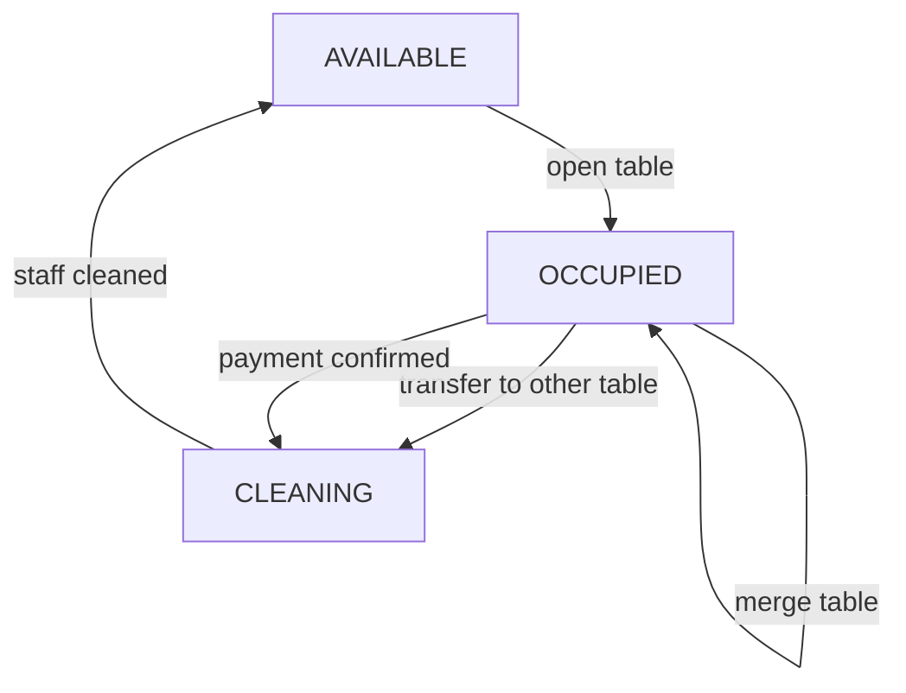

# Table Session Deep Dive

## 1. Khái Niệm

**Dining session** là một phiên ăn đang hoạt động của một hoặc nhiều bàn.

Nếu ghép bàn:

```text
T01 + T02 cùng thuộc session #1
```

## 2. Business Rules

| Rule | Policy | Lý do |
|---|---|---|
| Chỉ mở bàn khi `AVAILABLE` | `TableSessionPolicy.canOpenTable` | Tránh double session |
| Không mở bàn đang `CLEANING` | `TableCleanlinessPolicy` | Bàn chưa sẵn sàng |
| Ghép bàn available vào session active | `TableMergePolicy` | Khách ngồi thêm bàn |
| Ghép hai bàn đều có session thì phải merge order/bill context | `SessionMergePolicy` | Tránh mất order |
| Chuyển bàn chỉ sang bàn `AVAILABLE` | `TableTransferPolicy` | Tránh đè session khác |
| Bàn cũ sau khi chuyển sang `CLEANING` | `TableCleanlinessPolicy` | Cần dọn trước khi dùng lại |

## 3. Edge Cases

| Edge case | Tình huống | Cách xử lý | Audit | Notification |
|---|---|---|---|---|
| Mở bàn đã occupied | Cashier mở T01 hai lần | Reject, báo “Table is not available” | Optional warning | Không |
| Mở bàn cleaning | Khách mới ngồi bàn chưa dọn | Reject, yêu cầu mark cleaned trước | Có thể audit | Không |
| Customer mở trang trước khi cashier mở bàn | `customer.html?table=T01` chưa có session | Disable order, hiển thị “bàn chưa kích hoạt” | Không | Sau khi mở bàn gửi `TABLE_OPENED` |
| Ghép bàn available | T01 active, T02 available | T02 vào session T01 | Audit merge | Customer T02 nhận table opened/merged |
| Ghép hai bàn đều có order | T01 session #1, T02 session #2 | Move order T02 sang session #1, close session #2 | Audit bắt buộc | Cashier/manager |
| Chuyển bàn khi đã có order | T01 chuyển sang T03 | Session giữ nguyên, chỉ đổi table mapping | Audit transfer | Customer T03 |
| Chuyển sang bàn occupied | Target đang có khách | Reject | Không | Không |
| Thanh toán xong nhưng quên dọn bàn | T01 vẫn cleaning | Không cho open table mới | Audit khi mark cleaned | Không |

## 4. State Transition Chi Tiết



## 5. Dữ Liệu Cần Bảo Toàn Khi Ghép/Chuyển Bàn

| Dữ liệu | Ghép bàn | Chuyển bàn |
|---|---|---|
| Session id | Giữ session chính | Giữ nguyên |
| Orders | Move về session chính nếu merge session | Giữ nguyên |
| Kitchen tasks | Không đổi | Không đổi |
| Bill | Recalculate theo session sau merge | Không đổi |
| Audit | Bắt buộc | Bắt buộc |
| Notification | Có nếu ảnh hưởng customer screen | Có |

## 6. Câu Hỏi Phản Biện Có Thể Gặp

| Câu hỏi | Trả lời |
|---|---|
| Vì sao bàn cũ sau chuyển bàn không available ngay? | Vì thực tế cần dọn bàn trước khi khách mới ngồi |
| Ghép bàn có làm mất order không? | Không, order được gắn với session; merge session phải move order |
| Vì sao không để customer tự mở bàn? | Casual dining cần staff kiểm soát bàn thực tế |
