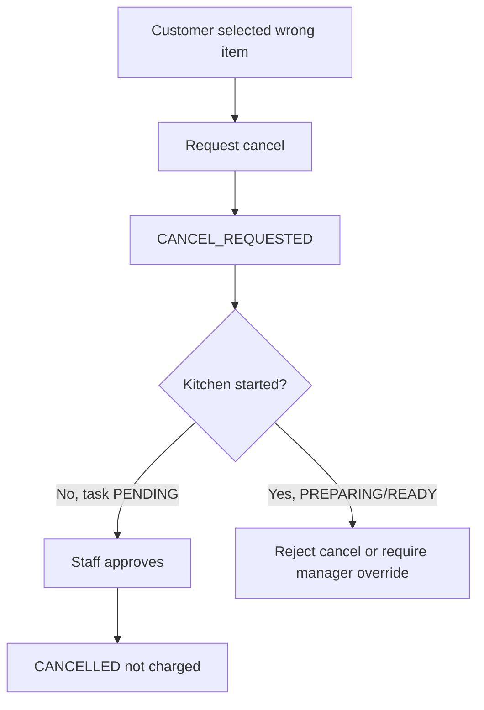

# Order And Cancellation Deep Dive

## 1. Bản Chất Order Trong Casual Dining

Một session có thể có nhiều order:

```text
Order #1: món chính
Order #2: gọi thêm nước
Order #3: gọi thêm dessert
```

Vì vậy order không phải bill. Bill là tổng hợp các order item hợp lệ cuối bữa.

## 2. Cancellation Flow



## 3. Business Rules

| Rule | Lý do |
|---|---|
| Order submit cần active session | Bàn chưa mở không được đặt món |
| Order submit cần ít nhất một item orderable | Tránh order rỗng |
| Cashier chỉ accept order `SUBMITTED` | Tránh accept trùng |
| Khi accept, item unavailable bị reject | Món có thể sold-out sau khi khách thêm vào cart |
| Bếp chỉ nhận item `ACCEPTED` | Tránh bếp làm món chưa duyệt |
| Customer chỉ xin hủy khi item `SUBMITTED` hoặc `ACCEPTED` | Nếu đang làm thì đã phát sinh chi phí |
| Staff chỉ approve cancel khi task chưa start | Bảo vệ chi phí bếp |
| Cancelled item không tính tiền | Công bằng cho khách |

## 4. Edge Cases

| Edge case | Tình huống | Xử lý | Ảnh hưởng bill | Audit/Notification |
|---|---|---|---|---|
| Submit cart rỗng | Khách bấm submit khi chưa chọn món | Reject | Không | Không |
| Bàn chưa active | Customer mở trang nhưng cashier chưa mở bàn | Disable submit/reject API | Không | Không |
| Món sold-out sau khi vào cart | Manager set sold-out trước khi submit/accept | Reject item khi submit hoặc accept | Không tính item reject | Audit availability |
| Double click submit | Khách bấm submit 2 lần | Dùng `idempotencyKey` | Tránh double bill | Audit một order |
| Cashier accept order hai lần | Hai cashier/tab cùng bấm | Lần sau reject `ORDER_NOT_SUBMITTED` | Không đổi | Audit warning |
| Customer hủy trước khi cashier accept | Item `SUBMITTED` | Cho request cancel; cashier approve | Không tính | Notify cashier |
| Customer hủy sau accept nhưng bếp chưa start | Task `PENDING` | Cho approve cancel | Không tính | Audit cancel |
| Customer hủy khi bếp đang làm | Task `PREPARING` | Reject cancel hoặc manager override | Vẫn tính nếu phục vụ | Audit bắt buộc |
| Customer hủy khi món ready | Task `READY` | Thường không cho hủy | Vẫn tính | Audit nếu exception |
| Order có một item bị reject, một item accepted | Partial accept | Tạo task cho item accepted | Chỉ tính item hợp lệ | Notify customer |

## 5. Policy Design

| Policy | Input | Output |
|---|---|---|
| `OrderingPolicy.canSubmitOrder` | session, cart | allow/deny |
| `MenuAvailabilityPolicy.canOrderItem` | menu item | allow/deny |
| `OrderApprovalPolicy.canAccept` | order status | allow/deny |
| `CancelPolicy.canRequestCancel` | order item status | allow/deny |
| `CancelPolicy.canApproveCancel` | order item + kitchen task | allow/deny |
| `BillingPolicy.isChargeableItem` | order item status | true/false |

## 6. Điểm Cần Nhấn Khi Bảo Vệ

- Hủy món không phải xóa record.
- Hủy món là một trạng thái nghiệp vụ có audit.
- Bếp đã bắt đầu làm thì hủy có tác động chi phí.
- Bill phải dựa trên item status, không dựa trên order được tạo hay chưa.
