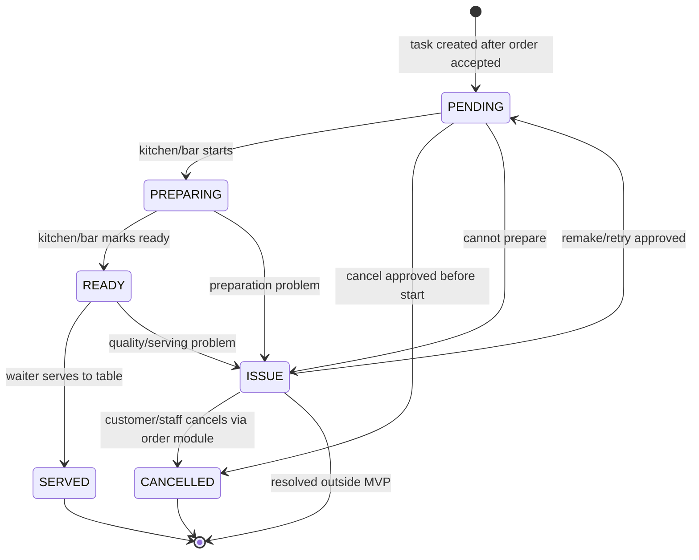
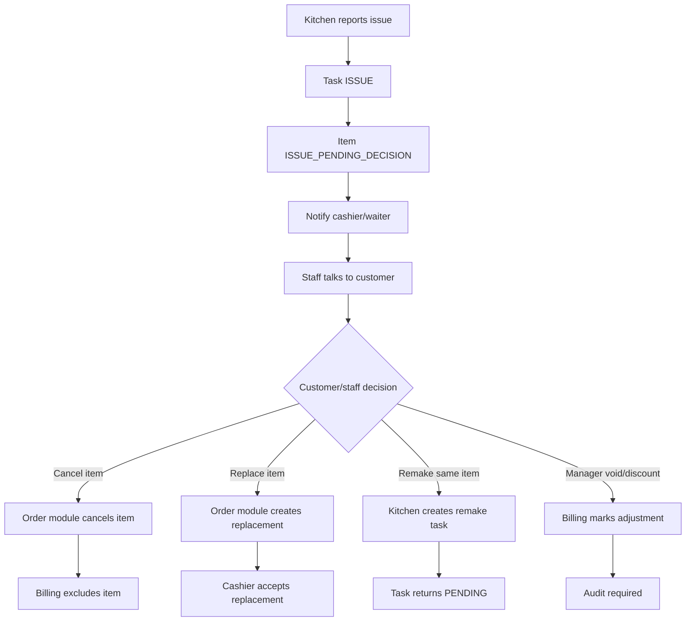

# Kitchen Fulfillment Deep Dive

## 1. Vai Trò Của Kitchen Fulfillment

Kitchen Fulfillment là module biến **order item đã được cashier duyệt** thành công việc vận hành cho bếp/bar.

Trong Casual dining, bếp không quyết định khách có hủy hay đổi món hay không. Bếp chỉ trả lời:

- Món này đã nhận chưa?
- Món này đang làm chưa?
- Món này đã sẵn sàng chưa?
- Món này có vấn đề khi chế biến không?

```text
Order accepted
→ Create preparation tasks
→ Route to kitchen/bar
→ Track preparation state
→ Report ready/served/issue
→ Billing reads final fulfillment state
```

## 2. Ranh Giới Với Module Sửa/Hủy Order

Vì hệ thống đã có module cho khách thay đổi hoặc hủy order, Kitchen Fulfillment không nên tự xử lý các quyết định thay khách.

| Tình huống | Module chịu trách nhiệm chính | Kitchen Fulfillment làm gì |
|---|---|---|
| Khách hủy món trước khi bếp làm | Order cancellation | Nhận event cancel task nếu task còn `PENDING` |
| Khách hủy khi bếp đang làm | Order cancellation + manager override | Cung cấp task status để policy quyết định |
| Khách đổi món vì món cũ hết | Order modification | Đánh dấu task/item `ISSUE`, chờ quyết định |
| Bếp báo hết nguyên liệu | Kitchen Fulfillment | Tạo kitchen issue, notify cashier/waiter |
| Bếp làm sai món | Kitchen Fulfillment + manager override | Ghi issue/remake/void, không tự sửa bill |
| Thanh toán cuối bữa | Billing/payment | Chỉ đọc task/item state, không sửa task |

Nguyên tắc:

- Bếp không tự xóa order item.
- Bếp không tự thay món cho khách.
- Bếp không tự quyết món có tính tiền hay không.
- Bếp chỉ tạo **fulfillment state** và **issue event** để module phù hợp xử lý tiếp.

## 3. Task Flow



## 4. Business Rules

| Rule | Policy | Lý do |
|---|---|---|
| Chỉ tạo task sau khi order được accept hoàn toàn | `CanCreateKitchenTaskPolicy` | Tránh bếp làm món khách/cashier chưa xác nhận |
| Không tạo task nếu order đang `NEEDS_CUSTOMER_CONFIRMATION` | `OrderReadyForFulfillmentPolicy` | Có món hết, khách chưa chọn tiếp |
| Task phải route theo station của menu item | `KitchenRoutingPolicy` | Food/bar có màn hình và trách nhiệm khác nhau |
| Thiếu station là lỗi cấu hình, không silently route fallback | `MenuConfigurationPolicy` | Tránh gửi nhầm bếp và khó truy vết |
| Task `PENDING` có thể bị cancel | `CanCancelPendingTaskPolicy` | Bếp chưa phát sinh công/nguyên liệu |
| Task `PREPARING` không hủy thường lệ | `CanInterruptPreparingTaskPolicy` | Đã phát sinh chi phí |
| Task `READY` cần waiter xác nhận `SERVED` nếu có waiter flow | `ReadyToServedPolicy` | Món sẵn sàng chưa chắc đã đến bàn |
| Task `ISSUE` luôn chặn bill | `KitchenIssueResolutionPolicy` | Tổng tiền chưa chắc chắn |
| Mọi correction ảnh hưởng bill phải audit | `KitchenAuditPolicy` | Cần giải thích khi đối soát |

## 5. Edge Case Theo Nhóm

## 5.1 Routing Và Cấu Hình Menu

| Edge case | Tình huống | Xử lý đúng | Notification | Audit |
|---|---|---|---|---|
| Item thiếu station | Cashier accept món nhưng menu item không có `station` | Không tạo task; đưa item vào `CONFIG_ERROR`; manager sửa cấu hình | Notify manager/cashier | Bắt buộc |
| Station không hoạt động | Bar/kitchen screen offline hoặc station disabled | Không route mù; task giữ `PENDING_ROUTING` hoặc báo manager | Notify manager | Có |
| Món có modifier ảnh hưởng bếp | Ví dụ “không đá”, “ít cay” | Task vẫn route station chính, modifier đi kèm task note | Notify station tương ứng | Audit theo order |
| Một order có food + drink | Cần tách task song song | Tạo task riêng cho kitchen và bar | Notify từng station | Có |

Điểm nghiệp vụ:

- Routing sai làm bếp không thấy món hoặc thấy sai món.
- Không nên “fallback kitchen” một cách âm thầm vì sẽ che giấu lỗi cấu hình.

## 5.2 State Transition Sai

| Edge case | Tình huống | Xử lý đúng | Notification | Audit |
|---|---|---|---|---|
| Start task đã cancel | Khách hủy trước khi bếp nhìn thấy | Reject start, task vẫn `CANCELLED` | Không cần hoặc báo nhẹ | Warning |
| Ready khi chưa start | Kitchen bấm nhầm ready từ `PENDING` | Reject nếu policy yêu cầu start trước | Báo lỗi kitchen | Warning |
| Start task hai lần | Nhân viên bấm lặp | Idempotent, giữ `PREPARING` | Không gửi lặp | Optional |
| Ready hai lần | Nhân viên bấm lặp | Idempotent, giữ `READY` | Không gửi lặp | Optional |
| Served trước ready | Waiter bấm nhầm served | Reject hoặc yêu cầu manager correction | Báo waiter | Có |
| Task preparing quá lâu | Món bị quên | Giữ state nhưng đánh dấu `DELAYED` | Notify cashier/waiter | Có thể audit |

Điểm nghiệp vụ:

- Kitchen task phải là state machine chặt, không cho nhảy trạng thái tùy tiện.
- Hành động lặp nên idempotent để tránh notification/bill bị nhân đôi.

## 5.3 Kitchen Issue Sau Khi Đã Accept

| Edge case | Tình huống | Xử lý đúng | Notification | Audit |
|---|---|---|---|---|
| Hết nguyên liệu khi chuẩn bị làm | Bếp phát hiện sau accept | Task `ISSUE`, item `ISSUE_PENDING_DECISION` | Cashier/waiter/customer | Bắt buộc |
| Món bị lỗi chất lượng | Cháy, sai vị, rơi đổ | Task `ISSUE`, cashier chọn remake/void sau khi nói với khách | Cashier/waiter | Bắt buộc |
| Làm sai món | Bếp làm nhầm item | Ghi issue; món đúng có thể remake, món sai không tự tính tiền | Manager/cashier | Bắt buộc |
| Phục vụ sai bàn | Waiter đưa nhầm bàn | Mark service issue; manager quyết định remake/void | Cashier/manager | Bắt buộc |
| Food ready nhưng drink chưa ready | Một phần order xong trước | Notify theo từng item/station, không chờ cả order nếu nhà hàng phục vụ từng món | Waiter/customer | Có |
| Customer yêu cầu gấp vì chờ lâu | Task preparing lâu | Cashier/waiter có thể ưu tiên task, không tự đổi bill | Kitchen/waiter | Optional |

Resolution flow cho kitchen issue:



Điểm quan trọng:

- `ISSUE` không đồng nghĩa với `CANCELLED`.
- `ISSUE` nghĩa là hệ thống đang chờ quyết định nghiệp vụ.
- Bill phải bị chặn cho đến khi issue được giải quyết.

## 5.4 Quan Hệ Với Thanh Toán

| Task status | Bill có được tạo không? | Item có tính tiền không? | Ghi chú |
|---|---|---|---|
| `PENDING` | Không | Chưa quyết | Bếp chưa bắt đầu |
| `PREPARING` | Không | Chưa quyết | Món đang làm |
| `DELAYED` | Không | Chưa quyết | Cần staff xử lý chậm món |
| `READY` | Tùy policy | Có thể | Nếu MVP không có waiter served thì có thể xem là billable |
| `SERVED` | Có | Có | Trạng thái tốt nhất để bill |
| `ISSUE` | Không | Chưa quyết | Chờ cancel/replace/remake/void |
| `CANCELLED` | Có nếu không còn blocker khác | Không | Không tính tiền |
| `VOIDED_BY_MANAGER` | Có | Không hoặc giảm | Cần audit lý do |

Khuyến nghị cho đồ án:

- Nếu có màn hình waiter: bill chỉ tính món `SERVED`.
- Nếu MVP chưa làm waiter flow: có thể dùng `READY` như trạng thái billable, nhưng phải nói rõ đây là shortcut MVP.

## 6. Điểm Cần Nhấn Khi Bảo Vệ

- Kitchen Fulfillment không phải nơi quyết định khách có hủy/đổi món hay không.
- Bếp tạo trạng thái vận hành; order module xử lý thay đổi order; billing module tính tiền dựa trên trạng thái cuối.
- `ISSUE` là trạng thái trung gian rất quan trọng để tránh tính tiền sai.
- Các thao tác bếp bị lặp nên idempotent, còn thao tác sai trạng thái phải bị policy chặn.
- Bill bị chặn không phải vì hệ thống yếu, mà vì nghiệp vụ chưa ổn định để tính tiền.
