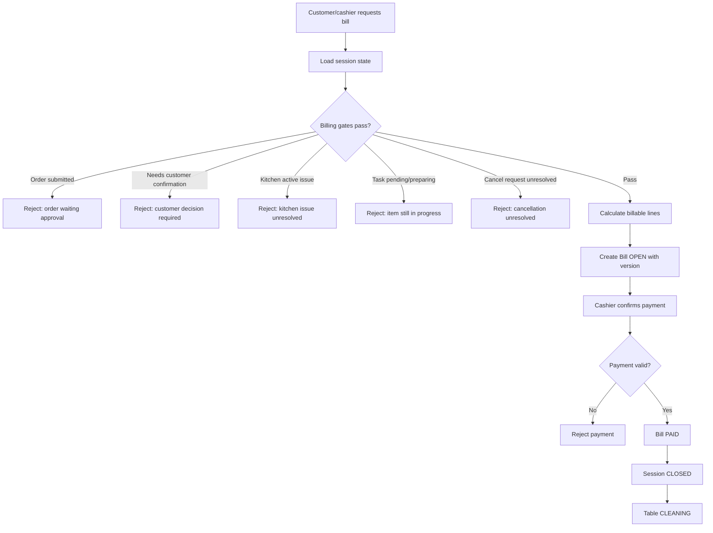
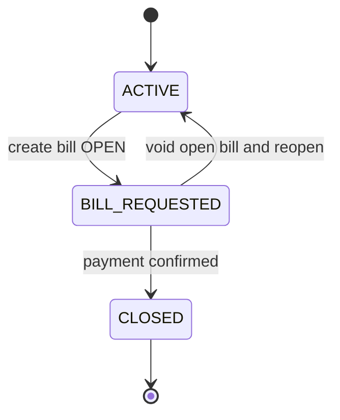

# Billing And Payment Deep Dive

## 1. Bản Chất Bill Trong Casual Dining

Bill không phải là phép cộng đơn giản của các món khách từng bấm.

Trong Casual dining, bill là **ảnh chụp cuối cùng của một dining session** sau khi:

- Order đã được cashier duyệt.
- Các món khách muốn sửa/hủy đã xử lý xong.
- Kitchen task không còn pending/preparing/issue.
- Các món bị hủy/void/reject đã được loại khỏi phần tính tiền.
- Cashier xác nhận phương thức thanh toán thủ công.

```text
Dining session
→ Stable order state
→ Stable kitchen fulfillment state
→ Bill OPEN
→ Manual payment confirmed by cashier
→ Bill PAID
→ Session CLOSED
→ Table CLEANING
```

## 2. Ranh Giới Với Module Sửa/Hủy Order Và Kitchen

Billing không được tự xử lý thay các module khác.

| Tình huống | Billing nên làm | Billing không nên làm |
|---|---|---|
| Order đang chờ khách xác nhận vì món hết | Chặn tạo bill | Không tự bỏ món hết |
| Khách có yêu cầu hủy chưa xử lý | Chặn tạo bill | Không tự approve/reject yêu cầu hủy |
| Kitchen task đang `ISSUE` | Chặn tạo bill | Không tự quyết cancel/remake/void |
| Task đang `PREPARING` | Chặn tạo bill | Không tính trước món đang làm |
| Món đã `CANCELLED` đúng policy | Loại khỏi bill | Không xóa lịch sử item |
| Món `VOIDED_BY_MANAGER` | Áp adjustment/zero charge theo audit | Không cho void thiếu lý do |

Nguyên tắc:

- Billing là nơi **đóng sổ**, không phải nơi sửa nghiệp vụ.
- Nếu trạng thái chưa ổn định, bill phải bị chặn và chỉ rõ blocker.
- Khi cần sửa order, quay lại order module.
- Khi cần xử lý issue bếp, quay lại kitchen/order resolution flow.

## 3. Billing Flow



## 4. Business Rules

| Rule | Policy | Lý do |
|---|---|---|
| Bill chỉ tạo cho session active | `CanCreateBillPolicy` | Không tạo bill cho bàn trống/đã đóng |
| Bill bị chặn nếu còn order `SUBMITTED` | `OrderApprovalGatePolicy` | Order chưa được cashier duyệt |
| Bill bị chặn nếu order `NEEDS_CUSTOMER_CONFIRMATION` | `CustomerDecisionGatePolicy` | Khách chưa quyết định sau sold-out/issue |
| Bill bị chặn nếu còn task `PENDING/PREPARING/ISSUE` | `KitchenCompletionGatePolicy` | Fulfillment chưa ổn định |
| Bill bị chặn nếu có cancel request unresolved | `CancellationResolutionGatePolicy` | Tổng tiền chưa chắc chắn |
| Bill line chỉ lấy item billable | `BillCalculationPolicy` | Không tính món hủy/reject |
| Bill OPEN khóa session khỏi order mới | `BillLockPolicy` | Tránh bill vừa tạo đã lỗi thời |
| Nếu muốn order thêm sau bill OPEN, phải void/reopen bill | `ReopenBillPolicy` | Tránh nhiều bill không nhất quán |
| Payment chỉ cashier xác nhận | `CanPayBillPolicy` | Tránh khách tự đóng session |
| Payment phải idempotent | `PaymentIdempotencyPolicy` | Tránh trả tiền hai lần |
| Hành động ảnh hưởng tiền phải audit | `BillingAuditPolicy` | Cần đối soát |

## 5. Chargeability Matrix

| Order item / task state | Tạo bill? | Tính tiền? | Cách xử lý |
|---|---|---|---|
| `SUBMITTED` | Không | Chưa | Chờ cashier accept/reject |
| `NEEDS_CUSTOMER_CONFIRMATION` | Không | Chưa | Khách chọn bỏ/thay/hủy |
| `ACCEPTED` nhưng chưa có task ổn định | Không | Chưa | Chờ task được tạo/route |
| Task `PENDING` | Không | Chưa | Chờ bếp bắt đầu hoặc cancel hợp lệ |
| Task `PREPARING` | Không | Chưa | Chờ ready/served hoặc issue |
| Task `ISSUE` | Không | Chưa | Chờ cancel/replace/remake/void |
| Task `READY` | Tùy policy | Có thể | MVP có thể xem là billable nếu chưa có waiter served |
| Task `SERVED` | Có | Có | Trạng thái billable tốt nhất |
| Item `CANCELLED` | Có nếu không còn blocker khác | Không | Loại khỏi bill |
| Item `REJECTED` | Có nếu không còn blocker khác | Không | Loại khỏi bill |
| Item `REMOVED_BY_CUSTOMER` | Có nếu không còn blocker khác | Không | Loại khỏi bill |
| Item `VOIDED_BY_MANAGER` | Có | Không hoặc giảm | Cần audit lý do |

Khuyến nghị cho đồ án:

- Nếu muốn nghiệp vụ chặt: chỉ tính `SERVED`.
- Nếu muốn MVP đơn giản hơn: cho phép `READY` được tính tiền, nhưng ghi rõ `ReadyCountsAsServedPolicy = true`.

## 6. Edge Cases Chuyên Sâu

| Edge case | Tình huống | Xử lý đúng | Bill impact | Audit |
|---|---|---|---|---|
| Customer xin bill khi order đang submitted | Cashier chưa duyệt | Reject bill, liệt kê order chờ duyệt | Không tạo bill | Optional |
| Customer xin bill khi order cần khách xác nhận | Có món sold-out/issue đang chờ khách chọn | Reject bill, yêu cầu xử lý order trước | Không tạo bill | Có |
| Customer xin bill khi bếp đang preparing | Món chưa xong | Reject bill, báo món đang làm | Không tạo bill | Optional |
| Customer xin bill khi task `ISSUE` | Bếp báo lỗi món | Reject bill, yêu cầu cashier xử lý issue với khách | Không tạo bill | Có |
| Customer xin bill khi món `READY` chưa `SERVED` | Waiter chưa giao món | Tùy policy: block đến served hoặc cho bill nếu MVP xem ready là served | Có thể tạo bill | Có nếu override |
| Bill OPEN rồi khách muốn gọi thêm | Session đang khóa bill | Cashier void bill OPEN và reopen ordering | Bill cũ void, bill mới tính lại sau | Bắt buộc |
| Bill OPEN rồi có cancel/void mới | Bill snapshot lỗi thời | Invalidate/recalculate bill trước payment | Không thanh toán bill cũ | Bắt buộc |
| Cashier tạo bill hai lần | Click lặp | Return bill OPEN hiện tại | Không double bill | Optional |
| Cashier thanh toán bill đã paid | Click lặp hoặc refresh | Idempotent nếu cùng request; reject nếu request mới | Không đổi doanh thu | Warning |
| Payment thiếu tiền | Cashier nhập số tiền nhận nhỏ hơn total | Reject payment hoặc giữ bill OPEN | Không đóng session | Không bắt buộc |
| Payment thừa tiền mặt | Khách đưa nhiều hơn total | Cho phép, hiển thị tiền thối lại | Bill paid theo total | Có |
| Sau payment phát hiện sai món | Đã đóng bill | Ngoài MVP: manager adjustment/refund | Không sửa âm thầm | Bắt buộc |
| Crash sau khi bill paid nhưng session chưa closed | Dữ liệu không đồng bộ | Recovery job đóng session/table theo bill `PAID` | Không thu lại tiền | Bắt buộc recovery log |

## 7. Bill Lock Và Reopen Flow

Khi bill đã `OPEN`, session nên chuyển sang trạng thái `BILL_REQUESTED` hoặc có cờ `billLocked = true`.

Ý nghĩa:

- Khách không thể submit order mới từ màn hình bàn.
- Cashier không accept order mới vào bill đã tạo.
- Nếu khách muốn gọi thêm, cashier phải reopen session.



Edge case quan trọng:

| Tình huống | Cách xử lý |
|---|---|
| Khách đổi ý muốn gọi thêm sau khi bill in ra | Cashier void bill OPEN, session quay lại `ACTIVE` |
| Có order/cancel thay đổi sau bill OPEN | Bill chuyển `STALE`, bắt buộc recalculate |
| Bill đã `PAID` rồi khách muốn gọi thêm | Mở session mới hoặc ngoài scope MVP |

## 8. Payment Method Cho MVP

Vì MVP đồ án chưa cần payment gateway, nên payment là xác nhận thủ công bởi cashier.

| Method | Cách xử lý |
|---|---|
| `CASH` | Cashier nhập số tiền nhận, hệ thống tính tiền thối |
| `CARD_MANUAL` | Cashier xác nhận đã quẹt thẻ bên ngoài |
| `BANK_TRANSFER_MANUAL` | Cashier xác nhận đã nhận chuyển khoản |
| `MIXED` | Có thể ngoài scope MVP |

Khuyến nghị MVP:

- Bắt buộc có `paymentMethod`.
- Bắt buộc có `paidAmount >= bill.total` với tiền mặt.
- Với card/bank transfer manual, `paidAmount = bill.total`.
- Lưu `paymentConfirmedByStaffId`.

## 9. Điểm Cần Nhấn Khi Bảo Vệ

- Bill là kết quả của state machine, không phải tổng cart.
- Billing không sửa order, không sửa kitchen task, không tự hủy món.
- Bill bị chặn khi còn blocker là thiết kế đúng để tránh tính sai.
- Bill OPEN nên khóa session; muốn gọi thêm phải reopen để tính lại.
- Payment đóng session và chuyển bàn sang cleaning, nên nó là nghiệp vụ vận hành chứ không chỉ là lưu tiền.
