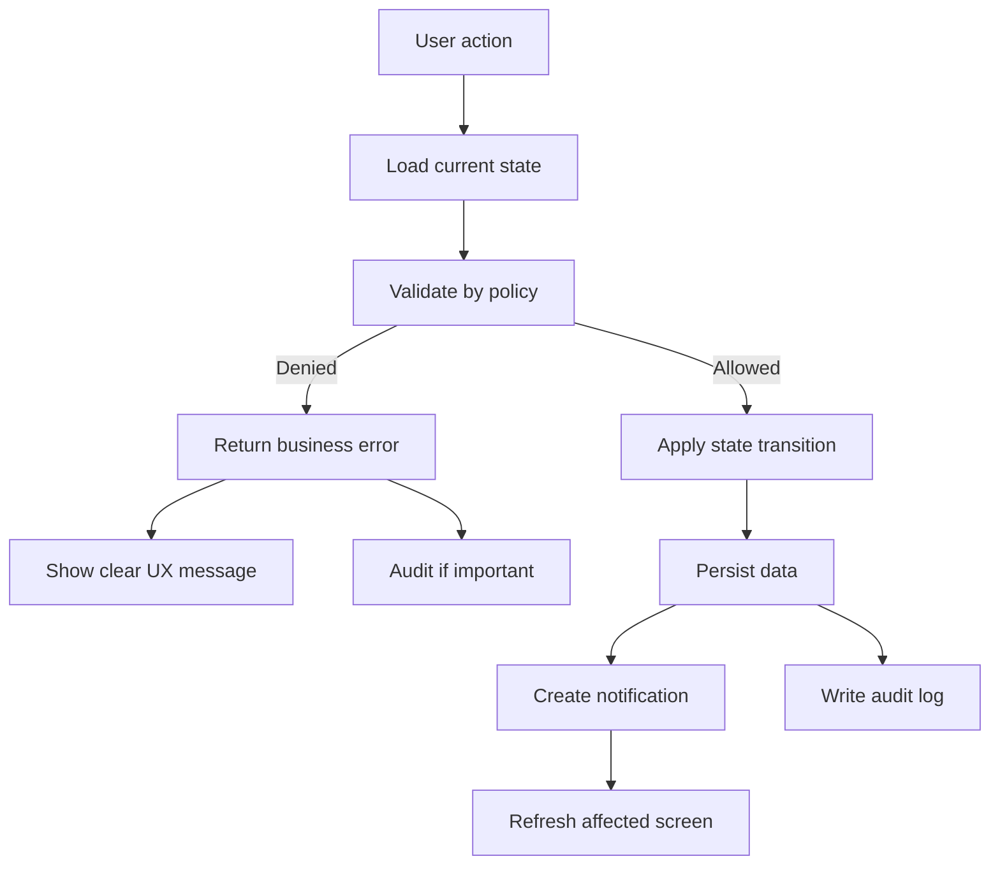
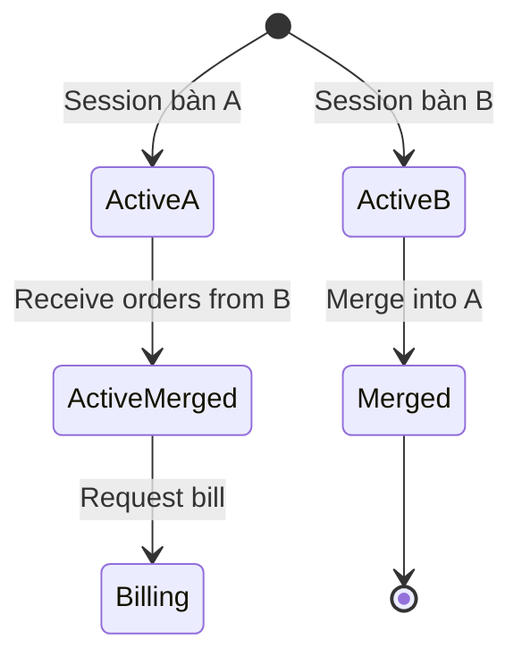
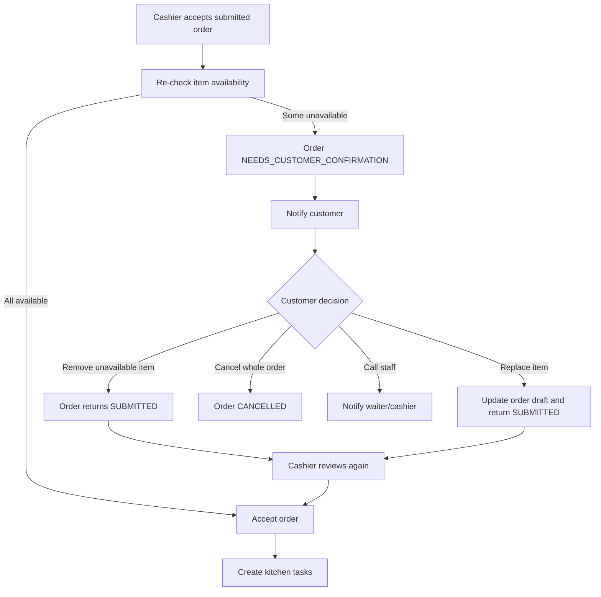
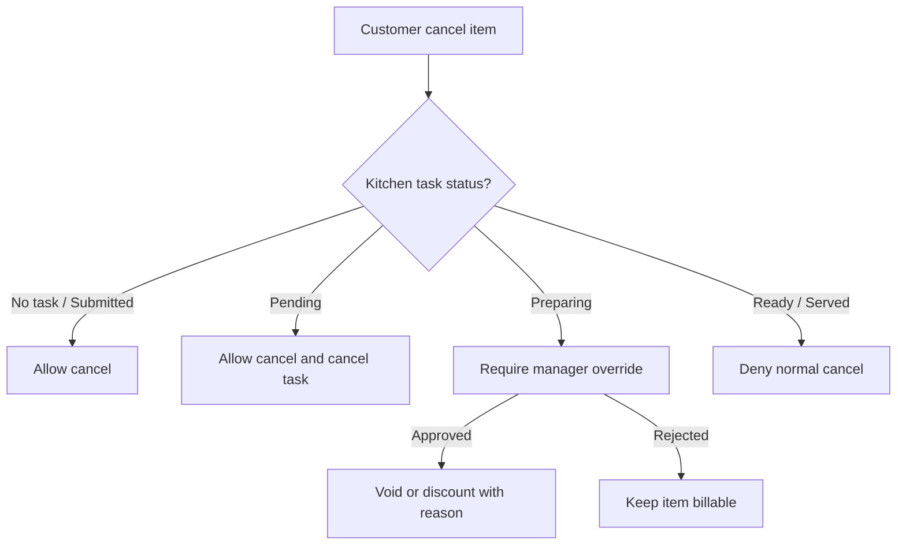
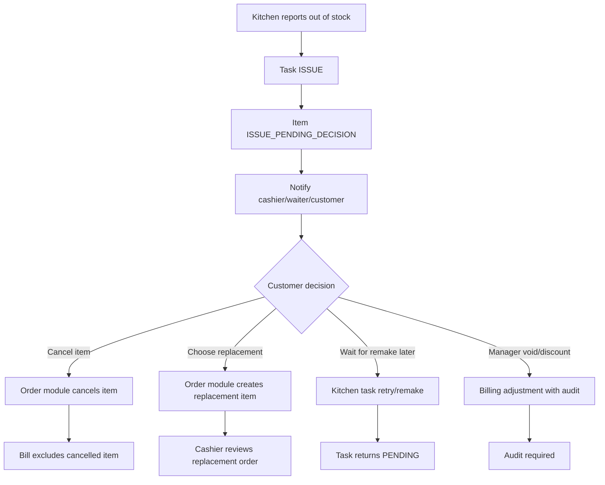

# Edge Case Resolution Playbook

Tài liệu này mô tả **cách ra quyết định khi edge case xảy ra** trong hệ thống nhà hàng **Casual dining**.

Mục tiêu không chỉ là “báo lỗi”, mà là:

- Giữ đúng nghiệp vụ nhà hàng.
- Không làm sai bill.
- Không gửi nhầm task xuống bếp.
- Không mất lịch sử xử lý.
- Luôn để cashier/waiter có cách can thiệp hợp lý.

## 1. Nguyên Tắc Xử Lý Chung

Mọi edge case nên đi qua cùng một khung xử lý:



### 1.1 Không Xóa Dữ Liệu Nghiệp Vụ Quan Trọng

Các hành động như hủy món, chuyển bàn, ghép bàn, hủy task bếp không nên `delete` dữ liệu.

Thay vào đó:

| Hành động | Cách xử lý đúng |
|---|---|
| Hủy món | Đổi trạng thái order item sang `CANCELLED` |
| Bếp báo hết món | Đổi task sang `ISSUE` hoặc item sang `REJECTED` |
| Ghép bàn | Đóng session phụ, chuyển order sang session chính |
| Chuyển bàn | Giữ nguyên session, đổi `tableId` |
| Thanh toán | Đổi bill sang `PAID`, không xóa order |

Lý do:

- Cần truy vết khi giáo viên hỏi “vì sao bill không tính món này?”.
- Cần báo cáo doanh thu chính xác.
- Cần audit để biết ai xử lý.

## 2. Mẫu Phân Tích Một Edge Case

Mỗi edge case nên được mô tả theo format sau:

| Thành phần | Ý nghĩa |
|---|---|
| Trigger | Ai làm gì khiến edge case xảy ra |
| Detection | Hệ thống phát hiện bằng state/rule nào |
| Policy | Rule nào quyết định cho phép/từ chối |
| Resolution | Hệ thống xử lý ra sao |
| Data impact | Bảng/trạng thái nào thay đổi |
| Bill impact | Có tính tiền hay không |
| Notification | Ai cần được thông báo |
| Audit | Có ghi log hay không |
| UX message | Người dùng nhìn thấy gì |

## 3. Edge Case Theo Nhóm Nghiệp Vụ

## 3.1 Table Session

### EC-01: Khách Thao Tác Khi Bàn Chưa Được Mở

| Mục | Phân tích |
|---|---|
| Trigger | Khách mở màn hình bàn và muốn đặt món |
| Detection | Không có `DiningSession` trạng thái `ACTIVE` cho `tableId` |
| Policy | `CanPlaceOrderPolicy` |
| Resolution | Không cho submit order, chỉ hiển thị menu ở chế độ xem nếu muốn |
| Data impact | Không tạo order |
| Bill impact | Không ảnh hưởng |
| Notification | Không cần hoặc gửi nhẹ cho cashier: “Khách ở bàn X đang chờ mở bàn” |
| Audit | Không bắt buộc |
| UX message | “Bàn chưa được kích hoạt. Vui lòng gọi nhân viên.” |

Quyết định nghiệp vụ:

- Với Casual dining, **nhân viên phải mở bàn trước**.
- Tránh trường hợp khách bên ngoài hoặc bàn chưa dọn xong tự đặt món.

### EC-02: Cashier Mở Một Bàn Đang Có Session Active

| Mục | Phân tích |
|---|---|
| Trigger | Cashier chọn mở bàn đã có khách |
| Detection | `Table.status = OCCUPIED` hoặc tồn tại `DiningSession.ACTIVE` |
| Policy | `CanOpenTablePolicy` |
| Resolution | Từ chối mở session mới |
| Data impact | Không tạo session |
| Bill impact | Không ảnh hưởng |
| Notification | Hiển thị cảnh báo cho cashier |
| Audit | Ghi audit mức warning nếu cần |
| UX message | “Bàn này đang có khách, không thể mở thêm session.” |

Quyết định nghiệp vụ:

- Một bàn vật lý chỉ có **một session active** tại một thời điểm.
- Nếu cần thêm khách vào bàn hiện tại thì dùng nghiệp vụ **ghép bàn/thêm khách**, không mở session mới.

### EC-03: Chuyển Bàn Khi Bàn Đích Đang Có Khách

| Mục | Phân tích |
|---|---|
| Trigger | Waiter/cashier chuyển khách từ bàn A sang bàn B |
| Detection | Bàn B có `Table.status = OCCUPIED` |
| Policy | `CanTransferTablePolicy` |
| Resolution | Từ chối chuyển bàn; gợi ý dùng chức năng ghép bàn |
| Data impact | Không đổi `tableId` |
| Bill impact | Không ảnh hưởng |
| Notification | Báo cashier/waiter |
| Audit | Ghi nếu thao tác do staff thực hiện |
| UX message | “Bàn đích đang có khách. Hãy chọn bàn trống hoặc dùng ghép bàn.” |

Quyết định nghiệp vụ:

- **Chuyển bàn** dùng khi khách đổi sang bàn trống.
- **Ghép bàn** dùng khi hai nhóm khách muốn ngồi chung hoặc tính chung bill.

### EC-04: Ghép Hai Bàn Đều Có Order

| Mục | Phân tích |
|---|---|
| Trigger | Staff ghép bàn A và bàn B |
| Detection | Cả hai bàn đều có `DiningSession.ACTIVE` |
| Policy | `CanMergeTablePolicy` |
| Resolution | Chọn một session chính, chuyển order/session detail của bàn phụ sang session chính |
| Data impact | Session phụ chuyển sang `MERGED`; table phụ chuyển `AVAILABLE` hoặc `CLEANING` |
| Bill impact | Bill cuối bữa tính theo session chính |
| Notification | Báo cashier, waiter, các màn hình bàn liên quan |
| Audit | Bắt buộc ghi ai ghép, ghép từ bàn nào sang bàn nào |
| UX message | “Đã ghép bàn B vào bàn A. Bill sẽ được tính chung.” |

Quyết định nghiệp vụ:

- Không tạo bill riêng cho session phụ sau khi đã ghép.
- Nếu đã có bill mở ở session phụ thì phải chặn ghép hoặc yêu cầu hủy bill nháp trước.



## 3.2 Menu Và Inventory

### EC-05: Khách Đã Thêm Món Vào Giỏ Nhưng Món Vừa Sold Out

| Mục | Phân tích |
|---|---|
| Trigger | Khách submit cart sau khi món bị đổi sang `SOLD_OUT` |
| Detection | Re-check `item_availability` tại thời điểm submit |
| Policy | `CanSubmitOrderItemPolicy` |
| Resolution | Từ chối item không còn bán, cho khách sửa cart |
| Data impact | Không tạo order item cho món sold out |
| Bill impact | Không tính tiền |
| Notification | Có thể báo cashier nếu khách cần hỗ trợ |
| Audit | Ghi thay đổi availability trước đó, không cần audit cho khách submit fail |
| UX message | “Món X vừa hết. Vui lòng chọn món khác.” |

Quyết định nghiệp vụ:

- Cart trên màn hình bàn chỉ là dữ liệu tạm.
- Trạng thái món phải được kiểm tra lại khi submit, không tin hoàn toàn dữ liệu UI.

### EC-06: Cashier Accept Order Nhưng Một Món Vừa Hết

| Mục | Phân tích |
|---|---|
| Trigger | Cashier duyệt order có món vừa hết |
| Detection | Re-check `item_availability` tại thời điểm accept |
| Policy | `CanAcceptOrderPolicy`, `MenuAvailabilityPolicy`, `UnavailableItemDecisionPolicy` |
| Resolution | Không accept ngay. Chuyển order sang trạng thái chờ khách quyết định |
| Data impact | Order `NEEDS_CUSTOMER_CONFIRMATION`, item hết hàng `UNAVAILABLE_PENDING_DECISION`, item còn hàng vẫn `SUBMITTED` |
| Bill impact | Chưa tính tiền, chưa tạo kitchen task |
| Notification | Báo khách chọn lại món; báo cashier order đang chờ xác nhận |
| Audit | Bắt buộc ghi món nào hết và ai phát hiện tại bước accept |
| UX message | “Món X vừa hết. Bạn muốn bỏ món này, chọn món khác, hay hủy toàn bộ đơn?” |

Quyết định nghiệp vụ đúng hơn cho Casual dining:

- **Không nên tự động accept một phần** nếu chưa hỏi khách.
- Lý do: món ăn thường đi theo combo ngữ cảnh của khách, ví dụ khách gọi cơm + món chính + nước. Nếu món chính hết mà hệ thống vẫn gửi cơm/nước xuống bếp thì trải nghiệm rất tệ.
- Cashier chỉ là người xác nhận nghiệp vụ, không nên tự ý thay đổi ý định gọi món của khách.
- Kitchen task chỉ được tạo sau khi khách xác nhận phiên bản order cuối cùng.

Các lựa chọn nên đưa cho khách:

| Lựa chọn | Khi nào dùng | Kết quả |
|---|---|---|
| Bỏ món hết và tiếp tục | Khách vẫn muốn các món còn lại | Item hết hàng `REMOVED_BY_CUSTOMER`, order quay lại `SUBMITTED` hoặc cashier accept lại |
| Chọn món thay thế | Khách muốn đổi món tương đương | Tạo/replace item mới, order quay lại `SUBMITTED` để cashier duyệt lại |
| Hủy toàn bộ order | Khách không muốn order nữa | Order `CANCELLED`, không gửi bếp |
| Gọi nhân viên | Khách cần tư vấn | Tạo notification cho waiter/cashier |



Biến thể policy:

| Mode | Ý nghĩa | Có nên dùng cho MVP? |
|---|---|---|
| `REQUIRE_CUSTOMER_CONFIRMATION` | Chặn accept, hỏi lại khách | Nên dùng mặc định |
| `ALLOW_PARTIAL_ACCEPT_WITH_CONFIRMATION` | Khách đã tick đồng ý nhận phần còn lại nếu món nào hết | Có thể dùng sau |
| `STAFF_DECIDES_FOR_CUSTOMER` | Cashier tự bỏ món hết và gửi phần còn lại | Không khuyến nghị |

Với MVP đồ án, chọn mode:

```text
UnavailableItemDecisionPolicy = REQUIRE_CUSTOMER_CONFIRMATION
```

Như vậy hệ thống thể hiện đúng nghiệp vụ hơn: **cashier không tự quyết thay khách**, còn policy layer vẫn giữ được khả năng mở rộng nếu sau này nhà hàng muốn cách xử lý khác.

## 3.3 Order Và Hủy Món

### EC-07: Khách Bấm Submit Nhiều Lần

| Mục | Phân tích |
|---|---|
| Trigger | Khách double-click hoặc CMD/web gửi lại request |
| Detection | Trùng `idempotencyKey` trong cùng session |
| Policy | `IdempotencyPolicy` |
| Resolution | Trả về order đã tạo trước đó, không tạo order mới |
| Data impact | Không nhân đôi order item |
| Bill impact | Không bị tính tiền hai lần |
| Notification | Không gửi lặp notification |
| Audit | Có thể ghi một log duplicate request mức debug |
| UX message | “Đơn đã được gửi trước đó.” |

Quyết định nghiệp vụ:

- Đây là edge case rất dễ gặp ở UI web/CMD.
- Bắt buộc có idempotency để tránh bếp nhận hai task giống nhau.

### EC-08: Khách Hủy Món Khi Chưa Được Cashier Duyệt

| Mục | Phân tích |
|---|---|
| Trigger | Khách đặt nhầm và hủy ngay |
| Detection | `OrderItem.status = SUBMITTED` |
| Policy | `CanCancelOrderItemPolicy` |
| Resolution | Cho hủy trực tiếp hoặc tạo yêu cầu hủy tùy rule MVP |
| Data impact | Item sang `CANCELLED` |
| Bill impact | Không tính tiền |
| Notification | Báo cashier order đã thay đổi |
| Audit | Ghi audit nhẹ vì ảnh hưởng order |
| UX message | “Món đã được hủy trước khi bếp nhận.” |

Quyết định nghiệp vụ khuyến nghị:

- Trong Casual dining, nếu bếp chưa nhận thì nên cho hủy.
- Cashier vẫn thấy lịch sử để tránh hiểu nhầm khi đối soát.

### EC-09: Khách Hủy Món Sau Khi Cashier Accept Nhưng Bếp Chưa Làm

| Mục | Phân tích |
|---|---|
| Trigger | Khách muốn hủy sau khi order đã gửi bếp |
| Detection | `OrderItem.status = ACCEPTED`, `KitchenTask.status = PENDING` |
| Policy | `CanCancelAcceptedItemPolicy` |
| Resolution | Cho hủy, đồng thời hủy kitchen task tương ứng |
| Data impact | Item `CANCELLED`, task `CANCELLED` |
| Bill impact | Không tính tiền |
| Notification | Báo bếp không làm món đó nữa, báo cashier |
| Audit | Bắt buộc ghi vì đã đi qua staff approval |
| UX message | “Món đã được hủy vì bếp chưa bắt đầu chế biến.” |

Quyết định nghiệp vụ:

- Đây là vùng “có thể cứu được”.
- Điều kiện quan trọng nhất là bếp chưa chuyển task sang `PREPARING`.

### EC-10: Khách Hủy Món Khi Bếp Đang Làm Hoặc Đã Làm Xong

| Mục | Phân tích |
|---|---|
| Trigger | Khách đổi ý muộn |
| Detection | `KitchenTask.status = PREPARING` hoặc `READY` |
| Policy | `CanCancelPreparingItemPolicy` |
| Resolution | Từ chối hủy thường; chỉ manager override nếu nhà hàng chấp nhận |
| Data impact | Nếu không override: giữ nguyên item/task; nếu override: item `VOIDED_BY_MANAGER` |
| Bill impact | Mặc định vẫn tính tiền; override có thể miễn/giảm |
| Notification | Báo cashier/waiter giải thích với khách |
| Audit | Bắt buộc ghi lý do và người duyệt |
| UX message | “Món đang được chế biến nên không thể hủy tự động. Vui lòng gọi nhân viên.” |

Quyết định nghiệp vụ:

- Đây là edge case thể hiện “văn hóa nhà hàng”.
- Một số nhà hàng vẫn hỗ trợ khách, nhưng hệ thống phải yêu cầu **manager override** để tránh thất thoát.



## 3.4 Kitchen Fulfillment

Ranh giới nghiệp vụ quan trọng:

| Việc xảy ra | Module xử lý chính | Kitchen Fulfillment chỉ làm gì |
|---|---|---|
| Khách muốn hủy/đổi món | Order cancellation/modification | Cung cấp trạng thái task để policy quyết định |
| Bếp không thể làm món | Kitchen Fulfillment | Đưa task vào `ISSUE`, notify staff/customer |
| Món có tính tiền hay không | Billing/payment | Cung cấp trạng thái `READY/SERVED/ISSUE/CANCELLED` |
| Cần miễn/giảm tiền do lỗi bếp | Manager override + billing | Ghi issue và lý do, không tự sửa bill |

Vì vậy, kitchen edge case không nên “hủy order thay khách”. Kitchen chỉ tạo tín hiệu nghiệp vụ để cashier/waiter trao đổi với khách hoặc để billing chặn thanh toán.

### EC-11: Bếp Báo Hết Món Sau Khi Order Đã Được Accept

| Mục | Phân tích |
|---|---|
| Trigger | Kitchen phát hiện nguyên liệu hết khi chuẩn bị làm |
| Detection | Staff chuyển task sang `ISSUE` với reason `OUT_OF_STOCK` |
| Policy | `KitchenIssuePolicy`, `OrderIssueResolutionPolicy` |
| Resolution | Dừng task, báo cashier/waiter trao đổi với khách qua module sửa/hủy order |
| Data impact | Task `ISSUE`, item `ISSUE_PENDING_DECISION` |
| Bill impact | Chặn bill cho đến khi khách chọn hủy, đổi món, remake hoặc manager void |
| Notification | Báo cashier/waiter/customer |
| Audit | Bắt buộc ghi lý do |
| UX message | “Bếp báo món X hiện không thể phục vụ. Vui lòng chọn món thay thế, hủy món hoặc gọi nhân viên.” |

Quyết định nghiệp vụ:

- Không tự động thay món.
- Không tự động hủy món.
- Không tự động tính hoặc miễn tiền.
- Cashier/waiter cần xác nhận với khách, sau đó gọi đúng flow ở module order.



### EC-12: Kitchen Đánh Dấu Ready Sai Món

| Mục | Phân tích |
|---|---|
| Trigger | Kitchen thao tác nhầm task |
| Detection | Task chưa `PREPARING` nhưng bị chuyển `READY`, hoặc wrong station |
| Policy | `CanMarkTaskReadyPolicy` |
| Resolution | Từ chối nếu state không hợp lệ; cho correction nếu manager/waiter xác nhận |
| Data impact | Không đổi hoặc ghi correction audit |
| Bill impact | Không ảnh hưởng nếu chưa served |
| Notification | Báo lỗi tại màn hình bếp |
| Audit | Ghi nếu có correction |
| UX message | “Task chưa ở trạng thái đang làm, không thể đánh dấu hoàn tất.” |

Quyết định nghiệp vụ:

- State machine của kitchen task phải chặt.
- Không cho nhảy trạng thái tùy tiện từ `PENDING` sang `READY` nếu rule yêu cầu phải `PREPARING` trước.

### EC-12A: Hủy Món Đến Bếp Cùng Lúc Bếp Bắt Đầu Làm

| Mục | Phân tích |
|---|---|
| Trigger | Khách/cashier hủy món gần như cùng lúc kitchen bấm start |
| Detection | So sánh task status hiện tại và thời điểm transition |
| Policy | `CancelKitchenRacePolicy` |
| Resolution | Nếu task vẫn `PENDING` tại lúc commit thì cancel; nếu đã `PREPARING` thì chuyển sang luồng manager override |
| Data impact | Một trong hai trạng thái hợp lệ: `CANCELLED` hoặc `PREPARING`, không có trạng thái nửa vời |
| Bill impact | `CANCELLED` không tính; `PREPARING` bị chặn/hay tính theo quyết định override |
| Notification | Báo cashier kết quả cuối cùng |
| Audit | Bắt buộc vì có race condition ảnh hưởng tiền |
| UX message | “Yêu cầu hủy được xử lý theo trạng thái bếp mới nhất.” |

Quyết định nghiệp vụ:

- Không được dựa vào trạng thái cũ trên UI.
- Phải reload task mới nhất trước khi quyết định.
- Đây là lý do policy cần nằm ở service/server, không nằm trong màn hình CMD/web.

### EC-12B: Món Ready Nhưng Chưa Được Phục Vụ Ra Bàn

| Mục | Phân tích |
|---|---|
| Trigger | Kitchen mark `READY`, nhưng waiter chưa giao món |
| Detection | Task `READY`, chưa có event `SERVED` |
| Policy | `ReadyToServedPolicy`, `ReadyCountsAsServedPolicy` |
| Resolution | Nếu có waiter flow thì chặn bill đến `SERVED`; nếu MVP không có waiter flow thì cho phép xem `READY` là billable |
| Data impact | Task giữ `READY` hoặc chuyển `SERVED` khi waiter xác nhận |
| Bill impact | Tùy policy, nhưng phải nhất quán toàn hệ thống |
| Notification | Báo waiter/cashier món đã sẵn sàng |
| Audit | Không bắt buộc, trừ khi có override |
| UX message | “Món đã sẵn sàng, đang chờ phục vụ ra bàn.” |

Quyết định nghiệp vụ:

- Thực tế nhà hàng nên có `SERVED`.
- Với MVP có thể giản lược bằng `READY`, nhưng khi bảo vệ phải nói rõ đây là shortcut để giảm scope.

### EC-12C: Bếp Làm Sai Món Hoặc Phục Vụ Sai Bàn

| Mục | Phân tích |
|---|---|
| Trigger | Kitchen/waiter phát hiện món sai hoặc đưa nhầm bàn |
| Detection | Staff report issue với reason `WRONG_ITEM` hoặc `WRONG_TABLE` |
| Policy | `KitchenServiceIssuePolicy`, `ManagerOverridePolicy` |
| Resolution | Đưa task/item vào `ISSUE`; manager/cashier quyết định remake, void hoặc discount |
| Data impact | Task `ISSUE`, item `ISSUE_PENDING_DECISION` hoặc `VOIDED_BY_MANAGER` |
| Bill impact | Chặn bill cho đến khi có quyết định; không tự tính món sai |
| Notification | Báo manager/cashier/waiter |
| Audit | Bắt buộc |
| UX message | “Món có vấn đề phục vụ, cần nhân viên xử lý trước khi thanh toán.” |

Quyết định nghiệp vụ:

- Sai món/sai bàn là lỗi vận hành, không phải hủy món thông thường của khách.
- Cần manager override nếu ảnh hưởng doanh thu.

## 3.5 Billing Và Payment

### EC-13: Khách Yêu Cầu Bill Khi Vẫn Còn Món Đang Làm

| Mục | Phân tích |
|---|---|
| Trigger | Customer/cashier tạo bill cuối bữa |
| Detection | Session còn task `PENDING`, `PREPARING`, `ISSUE`, order `NEEDS_CUSTOMER_CONFIRMATION` hoặc cancel request chưa xử lý |
| Policy | `CanCreateBillPolicy`, `KitchenCompletionGatePolicy`, `CustomerDecisionGatePolicy` |
| Resolution | Chặn tạo bill, hiển thị danh sách blocker và module cần xử lý |
| Data impact | Không tạo bill |
| Bill impact | Không tính thiếu món |
| Notification | Báo cashier/waiter cần xử lý trước |
| Audit | Không bắt buộc, trừ khi staff cố tạo nhiều lần |
| UX message | “Chưa thể thanh toán vì còn món/order chưa xử lý xong.” |

Quyết định nghiệp vụ:

- Bill cuối bữa chỉ nên tạo khi trạng thái bữa ăn ổn định.
- Tránh tình trạng khách trả tiền xong nhưng món vẫn ra sau.
- Billing không tự hủy món, không tự bỏ món, không tự resolve kitchen issue.

### EC-14: Cashier Tạo Bill Hai Lần

| Mục | Phân tích |
|---|---|
| Trigger | Cashier bấm tạo bill nhiều lần |
| Detection | Tồn tại bill `OPEN` hoặc `PAID` cho session |
| Policy | `CanCreateBillPolicy`, `IdempotencyPolicy` |
| Resolution | Nếu bill `OPEN`, trả về bill hiện tại; nếu `PAID`, từ chối tạo mới |
| Data impact | Không tạo bill trùng |
| Bill impact | Không nhân đôi doanh thu |
| Notification | Không cần hoặc hiển thị message |
| Audit | Ghi nếu có thao tác trả tiền lặp |
| UX message | “Bill của bàn này đã tồn tại.” |

Quyết định nghiệp vụ:

- Một session chỉ có một bill cuối cùng.
- Nếu cần sửa bill sau thanh toán, phải đi qua luồng adjustment/refund ngoài MVP hoặc manager override.

### EC-15: Thanh Toán Khi Có Món Đã Hủy

| Mục | Phân tích |
|---|---|
| Trigger | Cashier thanh toán session có item `CANCELLED` |
| Detection | Bill calculation đọc trạng thái từng item |
| Policy | `BillCalculationPolicy` |
| Resolution | Không tính tiền món `CANCELLED`, hiển thị ở phần ghi chú nếu cần |
| Data impact | Bill lines chỉ gồm item billable |
| Bill impact | Tổng tiền loại bỏ món hủy |
| Notification | Không cần |
| Audit | Giữ audit hủy món để giải thích |
| UX message | “Món đã hủy không được tính vào bill.” |

Quyết định nghiệp vụ:

- Món `CANCELLED` trước khi làm không tính tiền.
- Món `VOIDED_BY_MANAGER` cần ghi lý do miễn/giảm.

### EC-15A: Bill Đã Mở Nhưng Khách Muốn Gọi Thêm

| Mục | Phân tích |
|---|---|
| Trigger | Cashier đã tạo bill `OPEN`, khách đổi ý gọi thêm món |
| Detection | Session đang `BILL_REQUESTED` hoặc có bill `OPEN` |
| Policy | `BillLockPolicy`, `ReopenBillPolicy` |
| Resolution | Không thêm món vào bill cũ. Cashier void bill `OPEN`, reopen session rồi khách/order tiếp |
| Data impact | Bill cũ `VOIDED`, session quay lại `ACTIVE` |
| Bill impact | Bill sẽ được tính lại sau |
| Notification | Báo table/cashier session đã mở lại |
| Audit | Bắt buộc |
| UX message | “Bill hiện tại sẽ bị hủy để bàn có thể gọi thêm món.” |

Quyết định nghiệp vụ:

- Bill `OPEN` là snapshot tại một thời điểm.
- Nếu cho order thêm mà không void/recalculate, bill rất dễ sai.

### EC-15B: Bill Open Bị Lỗi Thời Do Có Thay Đổi Order

| Mục | Phân tích |
|---|---|
| Trigger | Sau khi bill `OPEN`, có cancel/void/replacement được duyệt |
| Detection | `bill.sessionVersion < session.currentVersion` hoặc có event ảnh hưởng bill |
| Policy | `BillStalenessPolicy` |
| Resolution | Chặn payment bill cũ, yêu cầu recalculate bill |
| Data impact | Bill `STALE` hoặc `VOIDED`, tạo bill mới sau khi tính lại |
| Bill impact | Không thanh toán theo tổng cũ |
| Notification | Báo cashier bill cần tính lại |
| Audit | Bắt buộc |
| UX message | “Bill đã thay đổi do order được cập nhật. Vui lòng tính lại bill.” |

Quyết định nghiệp vụ:

- Không được thanh toán bill đã lỗi thời.
- Đây là lý do bill nên có version/snapshot.

### EC-15C: Cashier Nhập Sai Số Tiền Thanh Toán

| Mục | Phân tích |
|---|---|
| Trigger | Cashier nhập tiền mặt/card amount sai |
| Detection | So sánh `paidAmount` với `bill.total` và `paymentMethod` |
| Policy | `CanPayBillPolicy`, `PaymentAmountPolicy` |
| Resolution | Tiền thiếu thì reject; tiền mặt thừa thì tính tiền thối; card/bank transfer phải bằng total |
| Data impact | Nếu reject, bill vẫn `OPEN`; nếu pass, bill `PAID` |
| Bill impact | Không đóng session khi chưa đủ tiền |
| Notification | Hiển thị lỗi cashier |
| Audit | Ghi payment thành công; lỗi nhập tiền không bắt buộc |
| UX message | “Số tiền thanh toán chưa hợp lệ.” |

Quyết định nghiệp vụ:

- Payment manual vẫn cần rule.
- Không nên để cashier đóng session khi số tiền nhận nhỏ hơn tổng bill.

## 3.6 Notification Và Đồng Bộ Màn Hình

### EC-16: Màn Hình Bàn Không Nhận Được Thông Báo

| Mục | Phân tích |
|---|---|
| Trigger | Browser/CMD bị offline, polling chậm, server restart |
| Detection | Client không có notification mới nhưng dữ liệu DB đã đổi |
| Policy | `NotificationDeliveryPolicy` |
| Resolution | UI không phụ thuộc hoàn toàn notification; luôn refresh state từ API/DB |
| Data impact | Không đổi nghiệp vụ |
| Bill impact | Không ảnh hưởng |
| Notification | Có thể gửi lại theo `lastSeenNotificationId` |
| Audit | Không bắt buộc |
| UX message | “Đang đồng bộ lại trạng thái bàn...” |

Quyết định nghiệp vụ:

- Notification chỉ là tín hiệu “có thay đổi”.
- Database mới là source of truth.

### EC-17: Notification Bị Gửi Lặp

| Mục | Phân tích |
|---|---|
| Trigger | Client reconnect hoặc polling lại cùng mốc thời gian |
| Detection | Trùng `notificationId` hoặc event key |
| Policy | `NotificationDedupPolicy` |
| Resolution | Client bỏ qua notification đã đọc |
| Data impact | Không đổi nghiệp vụ |
| Bill impact | Không ảnh hưởng |
| Notification | Không hiển thị toast lặp |
| Audit | Không cần |
| UX message | Không hiển thị thêm |

Quyết định nghiệp vụ:

- Notification nên có ID tăng dần.
- Client lưu `lastSeenNotificationId` theo màn hình/actor.

## 4. Business Error Code Đề Xuất

Các lỗi nghiệp vụ nên có code rõ ràng thay vì chỉ trả text.

| Code | Khi nào xảy ra | Thông điệp gợi ý |
|---|---|---|
| `TABLE_NOT_ACTIVE` | Bàn chưa mở session | Bàn chưa được kích hoạt |
| `TABLE_ALREADY_ACTIVE` | Mở bàn đang có khách | Bàn đang có session hoạt động |
| `TARGET_TABLE_OCCUPIED` | Chuyển sang bàn đang có khách | Bàn đích đang có khách |
| `ITEM_UNAVAILABLE` | Món hết hoặc ngừng bán | Món hiện không thể phục vụ |
| `DUPLICATE_REQUEST` | Submit/Pay lặp request | Yêu cầu đã được xử lý |
| `ORDER_NOT_ACCEPTABLE` | Order không đủ điều kiện accept | Đơn không thể duyệt ở trạng thái hiện tại |
| `CANCEL_TOO_LATE` | Bếp đã làm/đã xong | Món không thể hủy tự động |
| `KITCHEN_TASK_INVALID_STATE` | Task nhảy sai trạng thái | Task bếp không ở trạng thái hợp lệ |
| `BILL_BLOCKED_BY_ACTIVE_TASK` | Còn món đang xử lý | Chưa thể tạo bill |
| `BILL_ALREADY_EXISTS` | Session đã có bill | Bill đã tồn tại |
| `PAYMENT_ALREADY_COMPLETED` | Thanh toán bill đã paid | Bill đã được thanh toán |
| `AUDIT_REQUIRED` | Hành động thiếu lý do/người duyệt | Cần ghi nhận lý do xử lý |

## 5. Mức Độ Ưu Tiên Edge Case Cho MVP

| Priority | Edge case | Lý do |
|---|---|---|
| P0 | Bàn chưa mở mà đặt món | Sai luồng cơ bản |
| P0 | Submit order lặp | Gây nhân đôi món/bill |
| P0 | Hủy món theo trạng thái bếp | Điểm nghiệp vụ quan trọng nhất |
| P0 | Sold out sau khi thêm cart | Thực tế nhà hàng rất hay gặp |
| P0 | Bill khi còn task đang xử lý | Có thể tính thiếu/sai tiền |
| P1 | Ghép bàn có order | Thể hiện hiểu nghiệp vụ casual dining |
| P1 | Chuyển bàn sang bàn occupied | Tránh sai session |
| P1 | Bếp báo issue sau accept | Luồng vận hành thực tế |
| P1 | Notification mất/lặp | Quan trọng khi có nhiều màn hình |
| P2 | Manager override hủy món muộn | Nâng cao, dùng để bảo vệ thiết kế policy |

## 6. Checklist Khi Thiết Kế Một Rule Mới

Trước khi thêm business rule mới, cần trả lời:

- Rule này thuộc module nào?
- Rule này chặn hành động hay chỉ cảnh báo?
- Rule này phụ thuộc trạng thái nào?
- Nếu rule fail thì bill có bị ảnh hưởng không?
- Ai cần nhận notification?
- Có cần audit không?
- Có cần manager override không?
- UI/CMD cần hiển thị message gì?

## 7. Kết Luận Thiết Kế

Hệ thống không xử lý edge case bằng cách rải `if else` trong UI.

Thiết kế đúng là:

```text
Action
→ Application Service
→ Policy Layer
→ State Transition
→ Repository
→ Notification
→ Audit
```

Cách này giúp:

- Tách nghiệp vụ khỏi giao diện CMD/web.
- Dễ giải thích khi bảo vệ đồ án.
- Dễ thay đổi rule nếu nhà hàng đổi quy trình.
- Giảm nguy cơ sai bill, sai order, sai task bếp.
