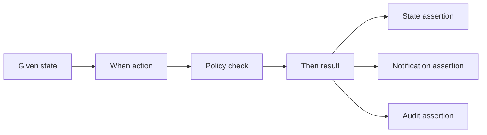
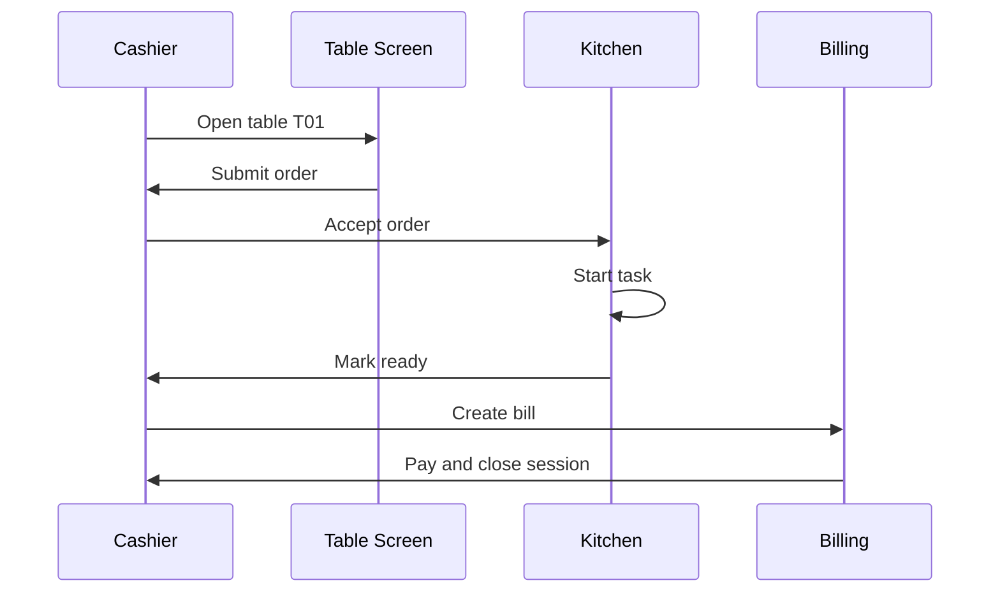

# Business Test Scenarios

Tài liệu này biến phân tích nghiệp vụ thành các **kịch bản kiểm thử có thể demo**.

Mục tiêu:

- Chứng minh hệ thống không chỉ CRUD dữ liệu.
- Chứng minh policy layer xử lý đúng edge case.
- Chuẩn bị câu trả lời khi giáo viên hỏi: “Nếu khách/nhân viên thao tác sai thì sao?”.

## 1. Cách Đọc Test Scenario

Mỗi scenario gồm:

| Thành phần | Ý nghĩa |
|---|---|
| Given | Trạng thái ban đầu của nhà hàng |
| When | Hành động người dùng thực hiện |
| Then | Kết quả nghiệp vụ mong muốn |
| State | Trạng thái dữ liệu sau xử lý |
| Notification | Ai nhận thông báo |
| Audit | Có ghi lịch sử hay không |

## 2. Scenario Nhóm Table Session

| ID | Given | When | Then | State | Notification | Audit |
|---|---|---|---|---|---|---|
| TS-01 | Bàn T01 `AVAILABLE` | Cashier mở bàn | Tạo session active | T01 `OCCUPIED`, session `ACTIVE` | Gửi cho màn hình bàn T01 | Có |
| TS-02 | Bàn T01 đã `OCCUPIED` | Cashier mở bàn lần nữa | Từ chối | Không đổi state | Báo lỗi cashier | Có thể ghi warning |
| TS-03 | Bàn T01 chưa mở | Customer submit order | Từ chối | Không tạo order | Báo khách/cashier nếu cần | Không bắt buộc |
| TS-04 | T01 active, T02 available | Staff chuyển T01 sang T02 | Chuyển thành công | Session đổi sang T02, T01 `CLEANING` | Báo T01/T02/cashier | Có |
| TS-05 | T01 active, T02 active | Staff chuyển T01 sang T02 | Từ chối | Không đổi session | Báo “bàn đích đang có khách” | Có |
| TS-06 | T01 active, T02 active | Staff ghép T02 vào T01 | Ghép thành công | T02 session `MERGED`, order về T01 | Báo các màn hình liên quan | Bắt buộc |

## 3. Scenario Nhóm Menu Và Inventory

| ID | Given | When | Then | State | Notification | Audit |
|---|---|---|---|---|---|---|
| MI-01 | Món M01 `ACTIVE`, `AVAILABLE` | Customer thêm vào cart | Cho thêm | Cart local có M01 | Không cần | Không |
| MI-02 | Món M01 vừa `SOLD_OUT` | Customer submit cart có M01 | Từ chối M01 | Không tạo item M01 | Báo khách món đã hết | Không bắt buộc |
| MI-03 | Order có M01 submitted | Cashier accept nhưng M01 hết | Chưa accept, yêu cầu khách quyết định | Order `NEEDS_CUSTOMER_CONFIRMATION`, M01 `UNAVAILABLE_PENDING_DECISION` | Báo khách/cashier | Có |
| MI-04 | Manager tắt món khỏi menu | Customer refresh menu | Không thấy món đó để đặt | `catalogStatus = INACTIVE` | Không cần | Có |
| MI-05 | Món còn trong catalog nhưng hết nguyên liệu | Customer xem menu | Món hiển thị sold out | `availability = SOLD_OUT` | Không cần | Có khi staff đổi trạng thái |

## 4. Scenario Nhóm Order Và Hủy Món

| ID | Given | When | Then | State | Notification | Audit |
|---|---|---|---|---|---|---|
| OR-01 | Session active, món available | Customer submit order | Order chờ duyệt | Order `SUBMITTED` | Cashier nhận thông báo | Có |
| OR-02 | Request OR-01 đã xử lý | Customer gửi lại cùng `idempotencyKey` | Không tạo order mới | Trả về order cũ | Không gửi lặp | Có thể debug |
| OR-03 | Order item `SUBMITTED` | Customer hủy món | Cho hủy | Item `CANCELLED` | Cashier nhận thông báo | Có |
| OR-04 | Item `ACCEPTED`, task `PENDING` | Customer hủy món | Cho hủy | Item/task `CANCELLED` | Bếp/cashier nhận thông báo | Bắt buộc |
| OR-05 | Task `PREPARING` | Customer hủy món | Chặn hủy tự động | Item vẫn billable | Cashier/waiter nhận thông báo | Có nếu có yêu cầu |
| OR-06 | Task `READY` | Customer hủy món | Từ chối | Item vẫn billable | Báo gọi nhân viên | Có |
| OR-07 | Task `PREPARING` | Manager override hủy | Cho void/discount theo lý do | Item `VOIDED_BY_MANAGER` | Cashier/bếp nhận thông báo | Bắt buộc |
| OR-08 | Order `NEEDS_CUSTOMER_CONFIRMATION` vì M01 hết | Customer bỏ M01 và tiếp tục | Order quay lại chờ cashier duyệt | M01 `REMOVED_BY_CUSTOMER`, order `SUBMITTED` | Cashier nhận thông báo | Có |
| OR-09 | Order `NEEDS_CUSTOMER_CONFIRMATION` vì M01 hết | Customer chọn món thay thế M02 | Order được chỉnh sửa và duyệt lại | M01 removed, M02 `SUBMITTED` | Cashier nhận thông báo | Có |
| OR-10 | Order `NEEDS_CUSTOMER_CONFIRMATION` vì M01 hết | Customer hủy toàn bộ order | Order bị hủy trước khi xuống bếp | Order `CANCELLED` | Cashier nhận thông báo | Có |

## 5. Scenario Nhóm Kitchen Fulfillment

| ID | Given | When | Then | State | Notification | Audit |
|---|---|---|---|---|---|---|
| KF-01 | Cashier accept món food | Hệ thống route task | Task vào bếp food | Task `PENDING`, station `KITCHEN` | Kitchen nhận thông báo | Có |
| KF-02 | Cashier accept món drink | Hệ thống route task | Task vào bar | Task `PENDING`, station `BAR` | Bar nhận thông báo | Có |
| KF-03 | Task `PENDING` | Kitchen start | Cho bắt đầu | Task `PREPARING` | Cashier/customer có thể thấy trạng thái | Có |
| KF-04 | Task `PREPARING` | Kitchen mark ready | Cho hoàn tất | Task `READY` | Waiter/cashier nhận thông báo | Có |
| KF-05 | Task `PENDING` | Kitchen mark ready nếu rule yêu cầu start trước | Từ chối | Task vẫn `PENDING` | Báo lỗi kitchen | Có thể ghi |
| KF-06 | Task đang làm nhưng hết nguyên liệu | Kitchen báo issue | Dừng xử lý | Task `ISSUE`, item chờ quyết định | Cashier/waiter/customer nhận thông báo | Bắt buộc |
| KF-07 | Task `PENDING`, khách hủy vừa được duyệt | Kitchen bấm start sau đó | Từ chối start | Task vẫn `CANCELLED` | Có thể báo kitchen | Warning |
| KF-08 | Task `PREPARING`, khách hủy cùng lúc | Hệ thống reload state | Không hủy thường lệ, cần manager override | Task `PREPARING` hoặc `VOIDED_BY_MANAGER` | Cashier nhận kết quả | Bắt buộc |
| KF-09 | Task `READY`, waiter chưa served | Cashier tạo bill | Tùy policy: block đến served hoặc cho bill nếu MVP dùng ready as served | Task `READY` | Báo cashier/waiter | Optional |
| KF-10 | Kitchen làm sai món | Kitchen report issue | Chặn bill, chờ manager/cashier xử lý | Task `ISSUE`, item `ISSUE_PENDING_DECISION` | Manager/cashier nhận thông báo | Bắt buộc |
| KF-11 | Food ready, drink chưa ready | Kitchen mark food ready | Chỉ notify món food ready, không tự close order | Food task `READY`, drink task `PREPARING` | Waiter/cashier nhận partial ready | Có |
| KF-12 | Item thiếu station | Cashier accept order | Không route task mù | Item `CONFIG_ERROR` hoặc order bị chặn fulfillment | Manager/cashier nhận thông báo | Bắt buộc |

## 6. Scenario Nhóm Billing Và Payment

| ID | Given | When | Then | State | Notification | Audit |
|---|---|---|---|---|---|---|
| BP-01 | Session có món served/ready, không pending | Cashier tạo bill | Tạo bill thành công | Bill `OPEN` | Customer/cashier thấy bill | Có |
| BP-02 | Session còn task `PREPARING` | Cashier tạo bill | Từ chối | Không tạo bill | Báo món đang xử lý | Có thể ghi |
| BP-03 | Session có item `CANCELLED` | Cashier tạo bill | Không tính item hủy | Bill line bỏ item đó | Không cần | Dựa vào audit hủy |
| BP-04 | Bill `OPEN` đã tồn tại | Cashier tạo bill lần nữa | Trả về bill cũ | Không tạo bill mới | Báo bill đã tồn tại | Có thể ghi |
| BP-05 | Bill `PAID` | Cashier thanh toán lại | Từ chối | Bill vẫn `PAID` | Báo đã thanh toán | Có |
| BP-06 | Bill `OPEN` | Cashier xác nhận tiền mặt | Thanh toán thành công | Bill `PAID`, session `CLOSED`, table `CLEANING` | Báo kết thúc bữa | Bắt buộc |
| BP-07 | Order `NEEDS_CUSTOMER_CONFIRMATION` | Cashier tạo bill | Từ chối, yêu cầu khách quyết định trước | Không tạo bill | Báo cashier/table | Có |
| BP-08 | Task `ISSUE` do bếp báo lỗi | Cashier tạo bill | Từ chối, yêu cầu resolve kitchen issue | Không tạo bill | Báo cashier/manager | Có |
| BP-09 | Bill `OPEN`, khách muốn gọi thêm | Cashier reopen session | Void bill cũ, mở lại ordering | Bill `VOIDED`, session `ACTIVE` | Báo table/cashier | Bắt buộc |
| BP-10 | Bill `OPEN` nhưng order thay đổi | Cashier pay bill cũ | Từ chối payment, yêu cầu recalculate | Bill `STALE` hoặc vẫn `OPEN` nhưng not payable | Báo cashier | Bắt buộc |
| BP-11 | Bill total 500k | Cashier nhập cash 400k | Từ chối payment | Bill vẫn `OPEN` | Báo thiếu tiền | Không bắt buộc |
| BP-12 | Bill total 500k | Cashier nhập cash 600k | Cho thanh toán, hiển thị change 100k | Bill `PAID`, session `CLOSED` | Báo hoàn tất | Có |

## 7. Scenario Nhóm Notification Và Audit

| ID | Given | When | Then | State | Notification | Audit |
|---|---|---|---|---|---|---|
| NA-01 | Cashier mở bàn | Table screen polling | Table screen thấy active session | State sync đúng | Nhận event/table state mới | Có audit mở bàn |
| NA-02 | Customer đặt món | Cashier screen polling | Cashier thấy order mới | Order `SUBMITTED` | Nhận notification mới | Có audit submit |
| NA-03 | Cashier accept order | Kitchen screen polling | Kitchen thấy task mới | Task `PENDING` | Nhận notification mới | Có audit accept |
| NA-04 | Client mất mạng rồi mở lại | Client gọi state API | UI đồng bộ theo DB | State mới nhất được hiển thị | Có thể đọc lại notification sau `lastSeenId` | Không cần |
| NA-05 | Notification gửi lặp | Client nhận cùng ID | Không hiện toast lặp | Không đổi state | Dedup notification | Không cần |
| NA-06 | Manager void món | Hệ thống xử lý | Có audit đầy đủ | Item `VOIDED_BY_MANAGER` | Cashier thấy thay đổi bill | Bắt buộc |

## 8. Bộ Demo Đề Xuất Khi Bảo Vệ

Nên demo theo thứ tự sau để vừa có happy path vừa có edge case:

### 8.1 Happy Path

| Step | Demo | Kết quả cần nói |
|---|---|---|
| 1 | Cashier mở bàn T01 | Session bắt đầu, table occupied |
| 2 | Customer đặt món | Order chưa xuống bếp ngay, phải chờ cashier duyệt |
| 3 | Cashier accept | Task bếp được tạo |
| 4 | Kitchen mark ready | Waiter/cashier biết món đã xong |
| 5 | Cashier tạo bill | Bill tính các món hợp lệ |
| 6 | Cashier thanh toán | Session đóng, bàn chuyển cleaning |

### 8.2 Edge Case Nên Demo

| Step | Edge case | Điểm nghiệp vụ cần nhấn mạnh |
|---|---|---|
| 1 | Đặt món khi bàn chưa mở | Hệ thống bảo vệ đúng flow casual dining |
| 2 | Submit order lặp | Idempotency tránh nhân đôi món |
| 3 | Sold out tại bước cashier accept | Chặn accept, hỏi lại khách thay vì tự bỏ món |
| 4 | Hủy món khi bếp chưa làm | Cho hủy, không tính tiền |
| 5 | Hủy món khi bếp đang làm | Chặn hoặc manager override |
| 6 | Tạo bill khi còn món đang làm | Chặn để tránh tính sai |
| 7 | Ghép bàn có order | Bill cuối bữa gom về session chính |

## 9. Coverage Map Theo Policy

| Policy | Scenario kiểm chứng |
|---|---|
| `CanOpenTablePolicy` | TS-01, TS-02 |
| `CanTransferTablePolicy` | TS-04, TS-05 |
| `CanMergeTablePolicy` | TS-06 |
| `CanPlaceOrderPolicy` | TS-03, OR-01 |
| `IdempotencyPolicy` | OR-02, BP-04 |
| `MenuAvailabilityPolicy` | MI-02, MI-03 |
| `CanCancelOrderItemPolicy` | OR-03, OR-04, OR-05, OR-06 |
| `ManagerOverridePolicy` | OR-07, NA-06 |
| `KitchenTaskStatePolicy` | KF-03, KF-04, KF-05 |
| `CancelKitchenRacePolicy` | KF-07, KF-08 |
| `ReadyToServedPolicy` | KF-09 |
| `KitchenIssuePolicy` | KF-06, KF-10 |
| `KitchenRoutingPolicy` | KF-01, KF-02, KF-12 |
| `CanCreateBillPolicy` | BP-01, BP-02, BP-04, BP-07, BP-08 |
| `BillCalculationPolicy` | BP-03 |
| `BillLockPolicy` | BP-09 |
| `BillStalenessPolicy` | BP-10 |
| `CanPayBillPolicy` | BP-05, BP-06, BP-11, BP-12 |
| `NotificationDedupPolicy` | NA-04, NA-05 |
| `AuditRequiredPolicy` | NA-06 |

## 10. Tiêu Chí Đạt Cho Phần Nghiệp Vụ

Một scenario được xem là đạt khi:

- Action được chặn/cho phép bởi đúng policy.
- State sau xử lý nhất quán với state machine.
- Không có order/task/bill bị nhân đôi.
- Món hủy không bị tính tiền sai.
- Màn hình liên quan nhận được thông báo hoặc có thể tự đồng bộ lại từ DB.
- Hành động ảnh hưởng tiền hoặc trách nhiệm nhân viên có audit.
- UX message giải thích được “vì sao không cho làm”.

## 11. Gợi Ý Chuyển Thành Test Code Sau Này

Khi triển khai test tự động, có thể map như sau:

| Loại test | Áp dụng |
|---|---|
| Unit test | Policy class, bill calculation |
| Service test | Open table, submit order, accept order, cancel item |
| Integration test | Order -> kitchen task -> bill |
| Scenario test | Các flow TS/OR/KF/BP/NA trong tài liệu này |
| Manual demo test | Bộ demo bảo vệ đồ án |

Ưu tiên code test:

1. Hủy món theo trạng thái bếp.
2. Bill không tính món hủy.
3. Submit order không bị duplicate.
4. Sold out tại submit/accept.
5. Tạo bill bị chặn khi còn task active.
6. Ghép/chuyển bàn không làm mất order.
