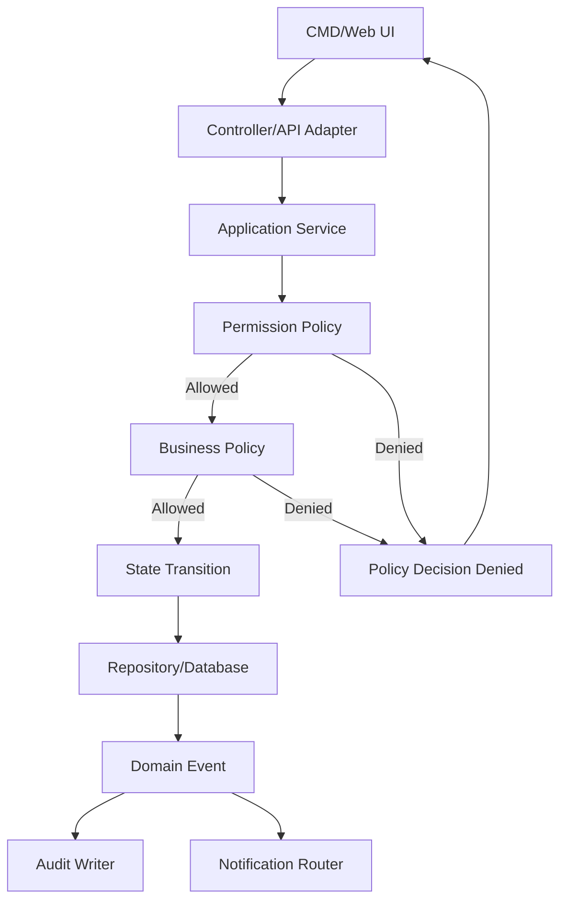

# Policy Architecture

## 1. Policy Nằm Ở Đâu?

Policy không nằm trong CMD/web UI. UI chỉ gửi command và hiển thị kết quả.



## 2. Nguyên Tắc Layer

| Layer | Được làm | Không được làm |
|---|---|---|
| UI/CMD/Web | Validate input cơ bản, hiển thị button/message | Tự quyết business rule |
| Controller/API | Parse request, tạo actor context, map response | Bỏ qua application service |
| Application Service | Load state, gọi policy, apply transition | Viết rule rải rác không tên |
| Policy Layer | Trả lời allow/deny + reason | Ghi DB trực tiếp |
| Repository | Lưu/đọc dữ liệu | Tự quyết nghiệp vụ |
| Audit/Notification | Ghi log/gửi event sau decision | Thay đổi state chính |

## 3. Thứ Tự Gọi Policy

```text
1. ActorContextPolicy
2. PermissionPolicy
3. ResourceExistencePolicy
4. BusinessStatePolicy
5. Money/Integrity Policy
6. AuditRequiredPolicy
7. NotificationRoutingPolicy
```

Ví dụ `AcceptOrder`:

```text
acceptOrder(orderId, actorId)
→ PermissionPolicy: actor có quyền order.accept?
→ OrderApprovalPolicy: order có SUBMITTED không?
→ MenuAvailabilityPolicy: item còn available không?
→ UnavailableItemDecisionPolicy: nếu sold-out thì hỏi lại khách
→ KitchenRoutingPolicy: item có station hợp lệ không?
→ AuditRequiredPolicy: accept/reject phải audit
→ NotificationRoutingPolicy: gửi khách/bếp/cashier
```

## 4. Policy Decision Output

Mọi policy trả về cùng một kiểu decision:

```json
{
  "allowed": false,
  "code": "ITEM_UNAVAILABLE_REQUIRES_CUSTOMER_DECISION",
  "message": "Món vừa hết, cần khách xác nhận lại order.",
  "requiredAction": "ASK_CUSTOMER_TO_MODIFY_ORDER",
  "affectedEntities": [
    {"type": "order", "id": "O-001"},
    {"type": "menuItem", "id": "M-001"}
  ],
  "auditRequired": true,
  "notificationTargets": ["customer:T01", "cashier"]
}
```

## 5. Source Of Truth

| Loại quyết định | Source of truth |
|---|---|
| Bàn/session active | `dining_sessions`, `dining_session_tables` |
| Món có được order | `menu_items`, `item_availability`, `branch_configs` |
| Order có được accept | `order_headers`, `order_items` |
| Hủy món được không | `order_items`, `preparation_tasks`, `task_items` |
| Task bếp hợp lệ | `preparation_tasks`, `task_items`, `kitchen_stations` |
| Bill được tạo không | session/order/task/cancel state |
| Payment được confirm không | `bills`, `payments`, actor permission |
| Notification route | domain event + recipient mapping |
| Audit required | action type + money/responsibility impact |

## 6. Khi Nào Không Cần Policy Riêng?

Không cần tạo policy riêng nếu chỉ là:

- Validate format đơn giản như số lượng phải là số dương.
- Parse command input.
- Render UI.
- Sort/filter danh sách không ảnh hưởng nghiệp vụ.

Nhưng cần policy riêng nếu hành động:

- Đổi trạng thái domain.
- Ảnh hưởng bill/doanh thu.
- Ảnh hưởng bếp.
- Cần phân quyền.
- Cần audit hoặc notification.

