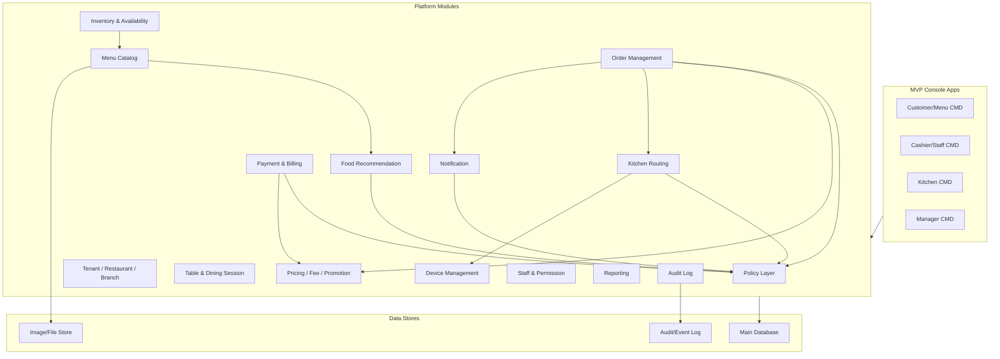
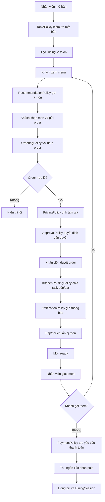

# Restaurant Table Ordering Platform - Tài Liệu Phân Tích Module

## 1. Phạm vi đồ án

Đồ án tập trung vào mô hình **Casual dining**: khách ngồi tại bàn, dùng màn hình/tablet cố định để gọi món, nhân viên xác nhận order, bếp/bar chuẩn bị món, phục vụ giao món và cuối bữa thu ngân xác nhận thanh toán.

Mục tiêu thiết kế là xây một hệ thống đủ gọn để triển khai trong phạm vi môn học, nhưng vẫn có khung mở rộng bằng **policy layer** thay vì viết workflow bằng nhiều nhánh `if else` cứng.

## 2. Cách đọc bộ tài liệu

File này là overview. Mỗi module được tách thành một file riêng trong thư mục `docs/modules`.

Nếu cần bản thiết kế sản phẩm hoàn chỉnh, có module map và đặc tả sâu từng module để triển khai code, đọc bộ tài liệu mới tại [product-design/README.md](product-design/README.md).

| Nhóm | File |
| --- | --- |
| Policy layer | [00-policy-layer.md](modules/00-policy-layer.md) |
| Tenant/Restaurant/Branch | [01-tenant-restaurant-branch.md](modules/01-tenant-restaurant-branch.md) |
| Table & Dining Session | [02-table-dining-session.md](modules/02-table-dining-session.md) |
| Menu Catalog | [03-menu-catalog.md](modules/03-menu-catalog.md) |
| Food Recommendation | [04-food-recommendation.md](modules/04-food-recommendation.md) |
| AI/ML Latent Factor Deep Dive | [04a-ai-ml-latent-factor-deep-dive.md](modules/04a-ai-ml-latent-factor-deep-dive.md) |
| Order Management | [05-order-management.md](modules/05-order-management.md) |
| Pricing, Tax, Fee, Promotion | [06-pricing-tax-fee-promotion.md](modules/06-pricing-tax-fee-promotion.md) |
| Payment & Billing | [07-payment-billing.md](modules/07-payment-billing.md) |
| Kitchen & Preparation Routing | [08-kitchen-preparation-routing.md](modules/08-kitchen-preparation-routing.md) |
| Device Management | [09-device-management.md](modules/09-device-management.md) |
| Notification | [10-notification.md](modules/10-notification.md) |
| Inventory & Availability | [11-inventory-availability.md](modules/11-inventory-availability.md) |
| Staff, Role, Permission | [12-staff-role-permission.md](modules/12-staff-role-permission.md) |
| Reporting | [13-reporting.md](modules/13-reporting.md) |
| Audit & Configuration Versioning | [14-audit-configuration-versioning.md](modules/14-audit-configuration-versioning.md) |
| Console CMD Runtime | [15-console-mvp-runtime.md](modules/15-console-mvp-runtime.md) |

## 3. Quyết định nghiệp vụ chính

| Nhóm | Quyết định cho MVP |
| --- | --- |
| Nhà hàng | Một nhà hàng Casual dining |
| Chi nhánh | Một chi nhánh |
| Bàn | Nhân viên mở bàn thủ công |
| Thiết bị bàn | Mỗi bàn có một màn hình/tablet cố định |
| Gọi món | Khách gọi món nhiều lần trong một `DiningSession` |
| Duyệt order | Nhân viên/lễ tân xác nhận trước khi gửi bếp |
| Bếp/bar | Nhận task trên KDS |
| Máy in nhiệt | Chỉ thiết kế extension, chưa tích hợp thật |
| Thanh toán | Cuối bữa, nhân viên xác nhận thủ công |
| QR/gateway | Có thể mô phỏng, chưa tích hợp gateway thật |
| Recommendation | Hybrid: latent factor đơn giản + rule-based fallback |
| Reservation | Không thuộc MVP, chỉ để mở rộng sau |
| Multi-tenant | Chưa triển khai thật, chỉ giữ cấu trúc mở rộng |
| Giao diện MVP | Nhiều cửa sổ CMD: khách/menu, bếp, thu ngân/quản lý |

## 4. Kiến trúc tổng quan



## 5. Workflow nghiệp vụ chính



## 6. Vì sao vẫn dùng policy

Trong đồ án, policy không cần là rule engine lớn. Policy có thể là các service đơn giản đọc từ cấu hình. Điểm quan trọng là workflow chính **không biết chi tiết nghiệp vụ**, nó chỉ gọi policy.

Ví dụ workflow không nên viết:

```text
if payment == "qr" then ...
if payment == "cashier" then ...
if restaurant == "buffet" then ...
```

Workflow nên viết:

```text
paymentPolicy.resolvePaymentFlow(context)
approvalPolicy.resolveApprovalStep(context)
kitchenRoutingPolicy.route(order)
recommendationPolicy.recommend(context)
```

Trong MVP Casual dining, hầu hết policy sẽ có một implementation mặc định. Sau này khi mở rộng sang buffet, cafe, fast food, QR payment hoặc multi-branch, ta thêm/chỉnh policy mà không phải đập lại workflow.

## 7. Thứ tự triển khai đề xuất

| Thứ tự | Module | Lý do |
| --- | --- | --- |
| 1 | Staff/Permission | Có tài khoản và quyền để thao tác hệ thống |
| 2 | Tenant/Branch | Có cấu hình nhà hàng mặc định |
| 3 | Table/Session | Có bàn và phiên phục vụ |
| 4 | Menu/Inventory | Có món để khách đặt |
| 5 | Order/Pricing | Tạo order và tính tiền |
| 6 | Kitchen/Notification | Gửi order xuống bếp và báo trạng thái |
| 7 | Payment/Billing | Kết thúc phiên bàn |
| 8 | Recommendation | Nâng trải nghiệm khách và demo thông minh |
| 9 | Console Runtime | Chạy nhiều cửa sổ CMD cho từng vai trò |
| 10 | Reporting/Audit | Hoàn thiện quản trị và truy vết |

## 8. MVP nên có

- Nhân viên đăng nhập theo role.
- Chạy nhiều cửa sổ CMD riêng cho khách/menu, bếp, thu ngân/quản lý.
- Quản lý menu và trạng thái còn/hết món.
- Mở bàn và tạo `DiningSession`.
- Khách xem menu, nhận gợi ý món và gửi order.
- Manager có thể train/kích hoạt latent factor recommendation model khi có dữ liệu order.
- Nhân viên duyệt order.
- Bếp/bar xem task và cập nhật trạng thái.
- Nhân viên phục vụ đánh dấu món đã giao.
- Thu ngân xem bill, xác nhận thanh toán và đóng bàn.
- Báo cáo doanh thu ngày, món bán chạy.
- Audit log cho order, payment và thay đổi cấu hình quan trọng.

## 9. Không làm trong MVP

- Payment gateway thật.
- Máy in nhiệt thật.
- Cảm biến bàn.
- Reservation đầy đủ.
- Multi-tenant SaaS đầy đủ.
- Buffet rule.
- Split bill.
- Promotion engine nâng cao.
- AI recommendation/cá nhân hóa nâng cao ngoài latent factor MVP.
- Web/tablet UI hoàn chỉnh.
