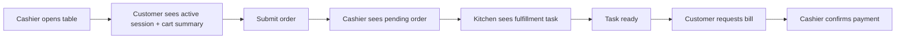

# UX/UI Console Review

Phạm vi review: MVP chạy bằng nhiều cửa sổ CMD cho nhà hàng casual dining.

## Vấn Đề Đã Phát Hiện

| Vấn đề | Ảnh hưởng UX | Cải thiện đã áp dụng |
|---|---|---|
| Menu chỉ liệt kê số, thiếu ngữ cảnh | Người dùng không biết luồng đúng là gì | Thêm workspace header và suggested flow cho từng vai trò |
| Bảng rỗng chỉ hiện tiêu đề | Người dùng tưởng hệ thống lỗi hoặc chưa đồng bộ | Thêm `[EMPTY]` message và hướng dẫn bước tiếp theo |
| Trạng thái kỹ thuật khó hiểu | Khách/nhân viên khó hiểu `SUBMITTED`, `ACCEPTED`, `CLEANING` | Thêm mô tả trạng thái như `Waiting cashier approval`, `Ready to serve` |
| Giá tiền chưa format | Khó đọc bill/menu khi số lớn | Format tiền dạng `138,000 VND` |
| Prompt nhập liệu thiếu ví dụ | Dễ nhập sai mã bàn/order/item | Thêm ví dụ như `T01`, giải thích cần nhập ID nào |
| Recommendation hiển thị score kỹ thuật | Khách không hiểu `score=0.50` | Chuyển sang `match xx%` và hint thêm món bằng ID |
| Cart không hiện tổng quan | Khách dễ quên đã thêm gì | Header customer hiển thị số lượng item và tổng tiền cart |
| Kết quả thao tác không nổi bật | Người dùng khó biết thành công/thất bại | Thêm prefix `[OK]` và `[WARN]` |

## Nguyên Tắc UI Cho MVP CMD

- Mỗi cửa sổ đại diện cho một actor cụ thể: `cashier`, `customer`, `kitchen`, `bar`, `manager`.
- Mỗi màn hình chính phải cho biết người dùng đang ở đâu và nên làm gì tiếp theo.
- Danh sách rỗng phải giải thích vì sao rỗng.
- Trạng thái nghiệp vụ phải hiển thị theo ngôn ngữ người dùng, không chỉ mã kỹ thuật.
- Prompt nhập liệu phải có ví dụ.
- Dữ liệu tiền tệ phải format dễ đọc.

## Luồng UX Sau Khi Cải Thiện

