# ĐỒ ÁN LẬP TRÌNH TÍNH TOÁN

# XÂY DỰNG ỨNG DỤNG ĐẶT MÓN ĂN TRONG NHÀ HÀNG SỬ DỤNG THUẬT TOÁN ĐỀ XUẤT

Người hướng dẫn: PGS. TS. NGUYỄN VĂN ANH

Sinh viên thực hiện: [Điền tên sinh viên, lớp, nhóm]

Đà Nẵng, [tháng/năm]

# MỞ ĐẦU

Trong các nhà hàng phục vụ tại bàn, quá trình nhận món, chuyển thông tin xuống bếp, theo dõi trạng thái chế biến và thanh toán cuối bữa thường liên quan đến nhiều bộ phận khác nhau. Nếu các thao tác này được thực hiện thủ công, nhân viên dễ ghi thiếu món, chuyển nhầm món, nhận đơn gọi món khi món đã hết hoặc tính sai hóa đơn khi khách hủy món. Bên cạnh đó, khách hàng thường cần được gợi ý món phù hợp với các món đã chọn, thời điểm dùng bữa và tình trạng còn/hết của thực đơn.

Từ thực tế đó, đề tài **"Xây dựng ứng dụng đặt món ăn trong nhà hàng sử dụng thuật toán đề xuất"** được thực hiện nhằm xây dựng một hệ thống hỗ trợ quy trình đặt món tại bàn. Hệ thống cho phép mở bàn, xem thực đơn, đặt món, duyệt đơn gọi món, chuyển món xuống bếp hoặc quầy nước, lập hóa đơn, xác nhận thanh toán và gợi ý món ăn cho khách trong phiên dùng bữa hiện tại.

Mục tiêu của đề tài là thiết kế và cài đặt một chương trình có luồng nghiệp vụ rõ ràng, đồng thời áp dụng thuật toán đề xuất để chọn ra danh sách món nên giới thiệu cho khách. Khác với các hệ thống thương mại điện tử có tài khoản người dùng, phạm vi đề tài không yêu cầu khách hàng đăng nhập. Mỗi lượt khách đang ăn tại bàn được biểu diễn bằng một `DiningSession`; các món đã gọi trong phiên ăn và lịch sử gọi món trước đó được dùng làm dữ liệu đầu vào cho thuật toán.

Phạm vi nghiên cứu của đề tài tập trung vào nhà hàng phục vụ tại bàn với một chi nhánh. Hệ thống hỗ trợ các vai trò chính gồm khách hàng, thu ngân hoặc nhân viên phục vụ, bếp hoặc quầy nước và quản lý. Các chức năng như đặt bàn trước, tích hợp cổng thanh toán thật, in bếp bằng máy in nhiệt, quản lý nhiều chi nhánh và chương trình khách hàng thân thiết không thuộc phạm vi triển khai của đồ án.

Phương pháp thực hiện gồm: phân tích quy trình nghiệp vụ, chia hệ thống thành các phân hệ, thiết kế dữ liệu, xây dựng thuật toán đề xuất, cài đặt chương trình bằng C++17, xây dựng giao diện dòng lệnh và giao diện Web, sau đó kiểm thử theo các kịch bản nghiệp vụ chính. Báo cáo được trình bày thành năm chương: tổng quan đề tài, cơ sở lý thuyết, tổ chức cấu trúc dữ liệu và thuật toán, chương trình và kết quả, kết luận và hướng phát triển.

# 1. TỔNG QUAN ĐỀ TÀI

## 1.1. Đặt vấn đề / Lý do chọn đề tài

Trong những năm gần đây, các ứng dụng đặt món ăn trực tuyến và các hệ thống quản lý nhà hàng ngày càng phát triển mạnh. Cùng với xu hướng số hóa trong lĩnh vực nhà hàng và dịch vụ ăn uống, nhiều thao tác trước đây được thực hiện thủ công như xem thực đơn, gọi món, chuyển món xuống bếp, theo dõi trạng thái chế biến và thanh toán dần được đưa vào các hệ thống phần mềm.

Tuy nhiên, khi thực đơn của nhà hàng có nhiều món, khách hàng thường mất nhiều thời gian để lựa chọn. Việc phải xem qua nhiều nhóm món như món chính, đồ uống, món ăn kèm và tráng miệng có thể làm khách hàng rơi vào tình trạng quá tải lựa chọn. Trong trường hợp này, nếu hệ thống chỉ liệt kê món ăn theo danh mục cố định thì chưa thật sự hỗ trợ khách hàng ra quyết định.

Các hệ thống đặt món truyền thống thường hiển thị thực đơn theo nhóm món hoặc theo thứ tự có sẵn. Cách làm này đơn giản nhưng chưa thích ứng với sở thích, lịch sử gọi món hoặc ngữ cảnh hiện tại của từng khách. Ví dụ, hai bàn ăn có nhu cầu khác nhau nhưng vẫn nhìn thấy cùng một danh sách món giống nhau. Điều đó làm giảm tính cá nhân hóa và chưa tận dụng được dữ liệu gọi món đã phát sinh trong hệ thống.

Để khắc phục hạn chế trên, đề tài đề xuất tích hợp thuật toán đề xuất (`recommendation algorithm`) vào ứng dụng đặt món ăn. Thuật toán đề xuất có nhiệm vụ phân tích dữ liệu món ăn, dữ liệu gọi món và ngữ cảnh hiện tại để gợi ý các món có khả năng phù hợp với khách hàng. Các ứng dụng như GrabFood, ShopeeFood hoặc các nền tảng thương mại điện tử đều sử dụng hệ thống đề xuất (`recommendation system`) để hiển thị sản phẩm, món ăn hoặc cửa hàng phù hợp hơn với từng người dùng. Điều này cho thấy hệ thống đề xuất có giá trị thực tiễn rõ ràng trong việc hỗ trợ lựa chọn và tăng khả năng bán thêm.

Xuất phát từ bối cảnh trên, đề tài **"Xây dựng ứng dụng đặt món ăn trong nhà hàng sử dụng thuật toán đề xuất"** được lựa chọn nhằm vận dụng kiến thức về cấu trúc dữ liệu, thuật toán và lập trình để giải quyết một bài toán gần với thực tế.

## 1.2. Mục tiêu của đề tài

Mục tiêu tổng quát của đề tài là xây dựng một ứng dụng đặt món ăn trong nhà hàng có tích hợp phân hệ gợi ý món dựa trên thuật toán đề xuất.

Các mục tiêu cụ thể gồm:

- Tìm hiểu các hướng tiếp cận phổ biến trong bài toán đề xuất, bao gồm lọc cộng tác, gợi ý dựa trên nội dung và hướng kết hợp nhiều tín hiệu.
- Phân tích bài toán gợi ý món ăn trong ngữ cảnh nhà hàng, trong đó mỗi lượt khách dùng bữa được biểu diễn bằng `DiningSession` và mỗi món ăn được biểu diễn bằng `MenuItem`.
- Lựa chọn cấu trúc dữ liệu phù hợp để lưu thông tin bàn, phiên phục vụ, món ăn, đơn gọi món, hóa đơn và dữ liệu phục vụ thuật toán đề xuất.
- Xây dựng thuật toán gợi ý món dựa trên dữ liệu gọi món, độ phổ biến của món, quan hệ giữa các món thường đi kèm và trạng thái còn/hết của thực đơn.
- Cài đặt chương trình đặt món có các chức năng chính như xem thực đơn, gửi đơn gọi món, xử lý bếp, thanh toán và gợi ý món.
- Thử nghiệm chương trình trên dữ liệu mẫu, quan sát kết quả gợi ý và đánh giá tính phù hợp của thuật toán trong phạm vi đồ án.

## 1.3. Đối tượng và phạm vi đề tài

Đối tượng nghiên cứu của đề tài gồm:

- Dữ liệu món ăn: tên món, nhóm món, giá, trạng thái còn/hết và thông tin phục vụ cho gợi ý.
- Dữ liệu phiên dùng bữa: bàn, phiên phục vụ, giỏ món, đơn gọi món và trạng thái thanh toán.
- Dữ liệu hành vi: lịch sử gọi món, số lượng món được gọi, trạng thái món và các sự kiện liên quan đến gợi ý.
- Thuật toán đề xuất món ăn trong bối cảnh nhà hàng.

Phạm vi của đề tài được giới hạn như sau:

- Về thuật toán, đề tài tập trung vào hướng đề xuất lai ở mức vừa phải, kết hợp ý tưởng lọc cộng tác trên dữ liệu `DiningSession x MenuItem`, độ phổ biến của món, quan hệ món thường đi kèm và một số quy tắc nghiệp vụ. Đề tài không đi sâu vào các mô hình học sâu hoặc hệ thống đề xuất quy mô lớn.
- Về dữ liệu, chương trình sử dụng dữ liệu mẫu và dữ liệu mô phỏng phù hợp với ngữ cảnh nhà hàng. Dữ liệu này đủ để minh họa quy trình đặt món, xử lý đơn và gợi ý món.
- Về chương trình, đề tài tập trung vào ứng dụng đặt món trong phạm vi nhà hàng, có giao diện dòng lệnh và giao diện Web đơn giản. Các chức năng như thanh toán trực tuyến thật, giao hàng, đặt bàn trước, tích hợp máy in bếp và quản lý nhiều chi nhánh không thuộc phạm vi chính của đồ án.
- Về nghiệp vụ, hệ thống tập trung vào các vai trò cơ bản: khách tại bàn, thu ngân hoặc nhân viên phục vụ, bếp hoặc quầy nước và quản lý.

## 1.4. Phương pháp thực hiện

Đề tài được thực hiện theo hai nhóm phương pháp chính.

Về mặt lý thuyết, đề tài tìm hiểu các tài liệu liên quan đến cấu trúc dữ liệu, tổ chức dữ liệu, thuật toán đề xuất, lọc cộng tác, gợi ý dựa trên nội dung và cách áp dụng các thuật toán này vào bài toán gợi ý món ăn. Bên cạnh đó, đề tài cũng phân tích quy trình nghiệp vụ của một nhà hàng phục vụ tại bàn để xác định các đối tượng dữ liệu và các thao tác chính cần có trong chương trình.

Về mặt thực nghiệm, đề tài xây dựng dữ liệu mẫu cho bàn, món ăn, đơn gọi món, tác vụ bếp, hóa đơn và dữ liệu tương tác dùng cho đề xuất. Từ đó, chương trình được cài đặt để kiểm thử các luồng chính: mở bàn, xem thực đơn, gửi đơn gọi món, duyệt đơn, xử lý bếp, lập hóa đơn và gợi ý món. Kết quả gợi ý được đánh giá thông qua việc quan sát danh sách món trả về, khả năng loại bỏ món không hợp lệ và mức độ phù hợp với ngữ cảnh gọi món hiện tại.

Công cụ và ngôn ngữ sử dụng gồm C++17 để cài đặt xử lý nghiệp vụ và thuật toán, CMake để biên dịch chương trình, HTML/CSS/JavaScript để xây dựng giao diện Web và các tệp văn bản để lưu dữ liệu phục vụ thử nghiệm. Các công cụ này sẽ được trình bày rõ hơn trong mục 4.2.

## 1.5. Ý nghĩa của đề tài

Về ý nghĩa khoa học, đề tài giúp vận dụng kiến thức của môn Lập trình tính toán vào một bài toán cụ thể. Thông qua việc xây dựng ứng dụng đặt món và thuật toán đề xuất, người thực hiện hiểu rõ hơn cách tổ chức cấu trúc dữ liệu, cách biểu diễn quan hệ giữa các đối tượng và cách xây dựng thuật toán xử lý dữ liệu trong một hệ thống có nhiều trạng thái nghiệp vụ.

Về ý nghĩa thực tiễn, hệ thống có thể hỗ trợ nhà hàng cải thiện trải nghiệm khách hàng bằng cách gợi ý món phù hợp hơn thay vì chỉ liệt kê thực đơn cố định. Khi gợi ý đúng món, khách hàng có thể lựa chọn nhanh hơn, nhà hàng có cơ hội tăng khả năng bán thêm đồ uống, món ăn kèm hoặc món tráng miệng. Ngoài ra, việc số hóa quy trình đặt món cũng giúp giảm sai sót trong phục vụ, hỗ trợ bếp theo dõi món cần làm và giúp thu ngân kiểm soát hóa đơn rõ ràng hơn.

# 2. CƠ SỞ LÝ THUYẾT

## 2.1. Ý tưởng

Ý tưởng chính của đề tài là mô hình hóa một lượt khách dùng bữa thành một đối tượng `DiningSession`. Mỗi `DiningSession` đại diện cho một bàn hoặc một nhóm bàn đang được phục vụ. Trong phiên đó, khách có thể gọi nhiều món, gọi thêm món nhiều lần và cuối cùng thanh toán bằng một hóa đơn.

Đối với bài toán đề xuất, hệ thống không dựa vào tài khoản khách hàng hay đánh giá sao. Thay vào đó, dữ liệu gọi món được xem là phản hồi ngầm. Nếu một món được gọi và được phục vụ, món đó thể hiện sự quan tâm của khách trong phiên ăn. Từ nhiều phiên ăn đã hoàn tất, hệ thống có thể học được món nào phổ biến, món nào thường đi cùng nhau và nhóm món nào thường được chọn theo từng thời điểm.

Trong phiên hiện tại, hệ thống suy ra khẩu vị tạm thời của bàn từ các món đã có trong giỏ hoặc đã được nhân viên duyệt. Nếu khách đã chọn món chính nhưng chưa chọn đồ uống, hệ thống có thể tăng điểm cho đồ uống phù hợp. Nếu món đã có trong giỏ hoặc trong đơn gọi món, hệ thống không gợi ý lại món đó. Nếu món đã hết hoặc phiên ăn đang ở trạng thái thanh toán, món đó bị loại trước khi hiển thị.

Toàn bộ thao tác quan trọng được kiểm tra bởi lớp chính sách nghiệp vụ. Giao diện dòng lệnh hoặc giao diện Web chỉ gửi yêu cầu của người dùng; các phân hệ xử lý nghiệp vụ và các chính sách nghiệp vụ sẽ quyết định thao tác có hợp lệ hay không. Cách tổ chức này giúp quy trình xử lý nhất quán giữa các vai trò và hạn chế việc lặp điều kiện nghiệp vụ trong giao diện.

## 2.2. Cơ sở lý thuyết

Hệ gợi ý là hệ thống tự động chọn ra các đối tượng có khả năng phù hợp với người dùng dựa trên dữ liệu đã quan sát. Trong đề tài này, đối tượng cần gợi ý là món ăn, còn người dùng được thay bằng `DiningSession`. Một số hướng tiếp cận thường gặp gồm:

- Gợi ý dựa trên nội dung: so sánh đặc trưng của món như nhóm món, giá, thời gian chuẩn bị hoặc khu vực chế biến.
- Lọc cộng tác: học từ hành vi của nhiều phiên ăn để tìm quan hệ ẩn giữa phiên ăn và món ăn.
- Gợi ý lai: kết hợp nhiều nguồn điểm để kết quả ổn định hơn và dễ giải thích hơn.

Vì nhà hàng không có dữ liệu đánh giá sao, bài toán được xem là bài toán phản hồi ngầm. Trọng số tương tác giữa phiên ăn `s` và món `i` được tính từ số lượng gọi món, trạng thái món, độ mới của dữ liệu và sự kiện tương tác với gợi ý:

$$
r_{si}
=
\log(1+q_{si}) \cdot w_{\text{status}}(\text{status}_{si})
\cdot \operatorname{decay}(t_s)
+ w_{\text{event}}(\text{event}_{si})
$$

Trong đó `q_si` là số lượng món, `w_status` loại bỏ các món bị hủy hoặc bị từ chối, `decay(t_s)` ưu tiên dữ liệu gần thời điểm hiện tại, còn `w_event` phản ánh việc khách bấm xem hoặc thêm món từ danh sách gợi ý.

Từ `r_si`, hệ thống tạo dữ liệu cho bài toán phân rã ma trận:

$$
p_{si} =
\begin{cases}
1, & r_{si} > 0 \\
0, & r_{si} = 0
\end{cases}
$$

$$
c_{si}=1+\alpha r_{si}
$$

Mô hình nhân tử ẩn biểu diễn mỗi phiên ăn và mỗi món bằng một véc-tơ ẩn kích thước `k`. Với phiên ăn `s` và món `i`, điểm dự đoán cơ bản là:

$$
\operatorname{score}_{lf}(s,i)
= \mu + b_s + b_i + x_s^{T}y_i
$$

Trong đó `x_s` là véc-tơ khẩu vị của phiên ăn, `y_i` là véc-tơ đặc trưng ẩn của món, `b_s` và `b_i` là độ lệch, còn `mu` là mức phổ biến trung bình. Hàm mất mát có dạng:

$$
L =
\sum_s \sum_i c_{si}
\left(p_{si} - \mu - b_s - b_i - x_s^{T}y_i\right)^2
+ \lambda \left(\lVert x_s \rVert^2 + \lVert y_i \rVert^2 + b_s^2 + b_i^2\right)
$$

Với phiên ăn đang diễn ra, hệ thống suy ra véc-tơ hiện tại từ các món trong giỏ hoặc trong đơn gọi món:

$$
x_{\text{current}}
= \operatorname{normalize}
\left(
\frac{\sum_i a_i y_i}{\sum_i a_i}
\right)
$$

Sau đó, mỗi món ứng viên `j` được chấm bằng công thức gợi ý lai:

$$
\begin{aligned}
\operatorname{score}(j)
=\;& w_{lf}\,x_{\text{current}}^{T}y_j
+ w_{pop}\,\operatorname{popularity}(j) \\
&+ w_{pair}\,\operatorname{pair\_score}(C,j)
+ w_{cat}\,\operatorname{category\_boost}(C,j) \\
&+ w_{time}\,\operatorname{time\_boost}(j,\text{now})
- w_{prep}\,\operatorname{prep\_penalty}(j) \\
&- w_{dup}\,\operatorname{duplicate\_penalty}(C,j)
\end{aligned}
$$

Trong đó `C` là tập món khách đã chọn hoặc đã gọi. Thành phần nhân tử ẩn phản ánh khẩu vị suy ra từ phiên ăn, độ phổ biến phản ánh món bán chạy, điểm món đi kèm phản ánh quan hệ giữa các món, hệ số nhóm món giúp cân bằng món chính, đồ uống và tráng miệng, còn các thành phần phạt giúp tránh gợi ý món trùng hoặc món mất quá nhiều thời gian chuẩn bị.

# 3. TỔ CHỨC CẤU TRÚC DỮ LIỆU VÀ THUẬT TOÁN

## 3.1. Phát biểu bài toán

Bài toán tổng quát của đề tài là xây dựng một hệ thống hỗ trợ đặt món tại bàn và đề xuất món ăn trong quá trình khách dùng bữa.

Dữ liệu đầu vào gồm:

- Danh sách bàn, trạng thái bàn và phiên phục vụ hiện tại.
- Danh sách món ăn, nhóm món, giá, trạng thái thuộc thực đơn, trạng thái còn/hết và khu vực chế biến.
- Giỏ hàng và các đơn gọi món hiện tại của phiên ăn.
- Lịch sử các đơn gọi món, số lượng món, trạng thái món và hóa đơn đã thanh toán.
- Trạng thái tác vụ bếp hoặc quầy nước.
- Vai trò người dùng và quyền thao tác.
- Sự kiện liên quan đến đề xuất như món đã được hiển thị, được bấm xem hoặc được thêm vào giỏ.

Dữ liệu đầu ra gồm:

- Danh sách món hợp lệ để khách có thể đặt.
- Đơn gọi món được tạo, được duyệt, bị từ chối hoặc được xử lý hủy theo đúng trạng thái.
- Tác vụ chế biến cho bếp hoặc quầy nước.
- Hóa đơn cuối bữa và trạng thái thanh toán.
- Danh sách N món được gợi ý, gồm mã món, điểm số và lý do gợi ý.
- Lịch sử thao tác, thông báo và báo cáo vận hành.

Các ràng buộc nghiệp vụ quan trọng:

- Chỉ phiên ăn đang hoạt động mới được đặt món và nhận gợi ý.
- Món phải có `catalogStatus = ACTIVE` và `availabilityStatus = AVAILABLE`.
- Không gợi ý món đã có trong giỏ hoặc trong đơn gọi món hiện tại.
- Đơn gọi món phải được nhân viên duyệt trước khi chuyển xuống bếp hoặc quầy nước.
- Món bị hủy hoặc bị từ chối không được tính vào hóa đơn và không tạo tín hiệu tích cực cho thuật toán đề xuất.
- Hóa đơn chỉ được tạo hoặc thanh toán khi không còn đơn gọi món, tác vụ bếp hoặc yêu cầu hủy đang chờ xử lý.

## 3.2. Cấu trúc dữ liệu

Thiết kế dữ liệu của hệ thống được trình bày theo từng khối nghiệp vụ để dễ theo dõi quan hệ giữa các bảng. Mỗi khối tập trung vào một phần của quy trình đặt món: quản lý bàn, thực đơn và đơn gọi món, bếp, thanh toán, đề xuất món và lịch sử thao tác.

### 3.2.1. Khối bàn và phiên phục vụ

Khối này lưu thông tin bàn vật lý và phiên phục vụ của khách. Một phiên phục vụ (`DiningSession`) là đơn vị trung tâm để liên kết bàn, đơn gọi món, hóa đơn và dữ liệu đề xuất.

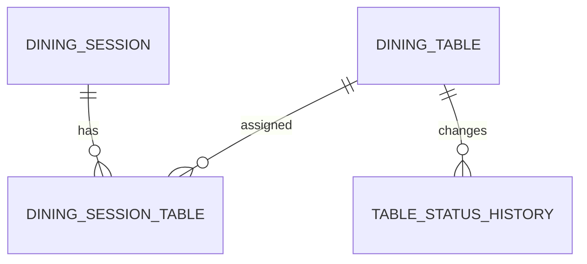

| Bảng | Vai trò | Trường chính |
| --- | --- | --- |
| `dining_tables` | Lưu bàn vật lý của nhà hàng | `id`, `code`, `area`, `capacity`, `status` |
| `dining_sessions` | Lưu phiên phục vụ của một lượt khách | `id`, `primaryTableId`, `status`, `guestCount`, `openedAt`, `closedAt` |
| `dining_session_tables` | Liên kết phiên phục vụ với một hoặc nhiều bàn | `sessionId`, `tableId`, `role`, `status` |
| `table_status_history` | Lưu lịch sử thay đổi trạng thái bàn | `tableId`, `fromStatus`, `toStatus`, `actorId`, `createdAt` |

Ràng buộc quan trọng của khối này là một bàn chỉ được gắn với một phiên phục vụ đang hoạt động tại một thời điểm. Ràng buộc này giúp tránh trường hợp khách ở hai phiên khác nhau cùng gọi món vào một bàn.

### 3.2.2. Khối thực đơn và đơn gọi món

Khối này biểu diễn thực đơn, món ăn, trạng thái còn/hết và đơn gọi món của khách. Đây là khối dữ liệu được sử dụng trực tiếp khi khách xem thực đơn, thêm món vào giỏ và gửi đơn gọi món.

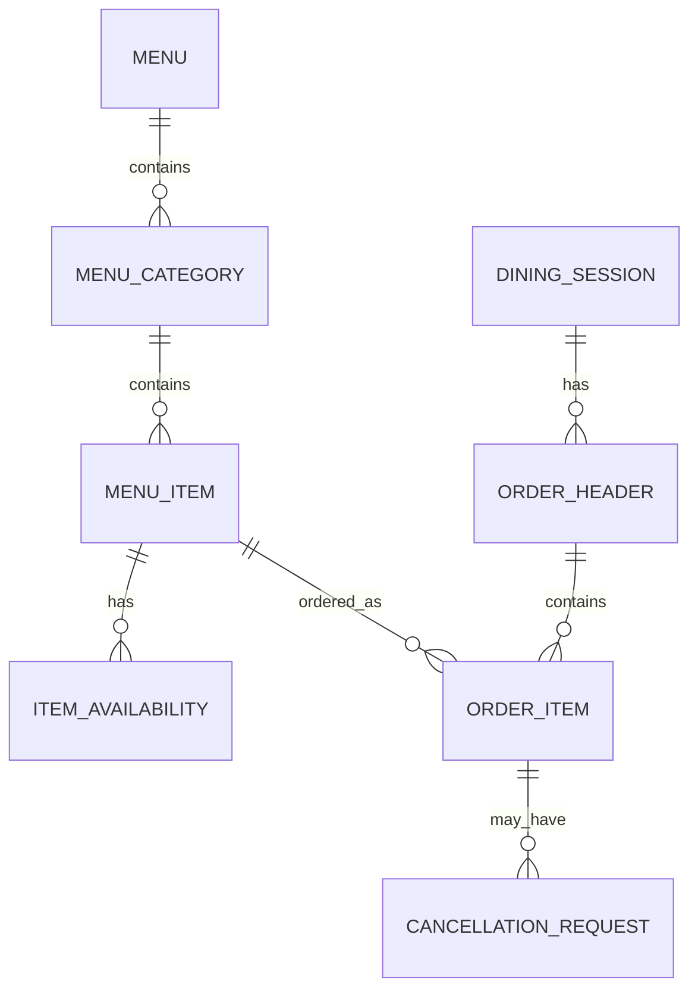

| Bảng | Vai trò | Trường chính |
| --- | --- | --- |
| `menus` | Lưu thực đơn của chi nhánh | `id`, `branchId`, `name`, `status` |
| `menu_categories` | Lưu nhóm món | `id`, `menuId`, `name`, `displayOrder` |
| `menu_items` | Lưu thông tin món ăn hoặc đồ uống | `id`, `categoryId`, `name`, `description`, `basePrice`, `catalogStatus` |
| `item_availability` | Lưu trạng thái còn/hết của món | `branchId`, `itemId`, `availabilityStatus`, `isOrderable`, `reason` |
| `order_headers` | Lưu đơn gọi món thuộc một phiên phục vụ | `id`, `sessionId`, `status`, `clientRequestId`, `submittedAt`, `acceptedBy` |
| `order_items` | Lưu từng món trong đơn gọi món | `id`, `orderId`, `menuItemId`, `quantity`, `unitPriceSnapshot`, `status` |
| `cancellation_requests` | Lưu yêu cầu hủy món | `id`, `orderItemId`, `requestedBy`, `reason`, `status`, `resolvedBy` |

Trong khối này, `menu_items.catalogStatus` cho biết món có còn thuộc thực đơn hay không, còn `item_availability.availabilityStatus` cho biết món có còn bán tại thời điểm hiện tại hay không. Khi tạo `order_items`, hệ thống lưu `unitPriceSnapshot` để hóa đơn không bị sai nếu giá món thay đổi sau thời điểm khách gọi món.

### 3.2.3. Khối bếp và quầy nước

Khối bếp và quầy nước lưu các tác vụ chế biến được tạo ra sau khi đơn gọi món được nhân viên duyệt. Khối này giúp hệ thống theo dõi món nào đang chờ làm, đang chế biến, đã sẵn sàng hoặc gặp sự cố.

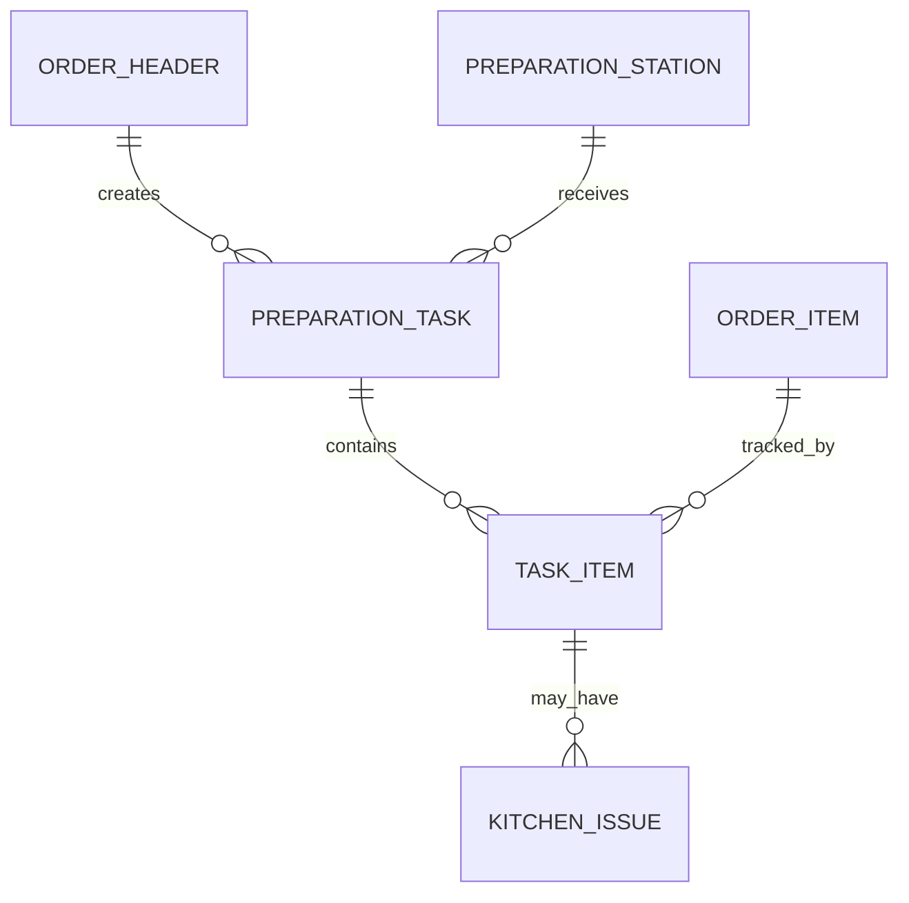

| Bảng | Vai trò | Trường chính |
| --- | --- | --- |
| `preparation_stations` | Lưu khu vực chế biến như bếp hoặc quầy nước | `id`, `branchId`, `name`, `type`, `status` |
| `station_routing_rules` | Lưu quy tắc chuyển nhóm món tới khu vực chế biến | `categoryId`, `stationId` |
| `preparation_tasks` | Lưu tác vụ chế biến theo đơn và khu vực | `id`, `orderId`, `stationId`, `status`, `createdAt` |
| `task_items` | Lưu các món thuộc một tác vụ chế biến | `taskId`, `orderItemId`, `quantity`, `status` |
| `kitchen_issues` | Lưu sự cố do bếp hoặc quầy nước báo | `taskItemId`, `reason`, `status`, `reportedBy` |

Quan hệ giữa `order_items` và `task_items` rất quan trọng vì chính sách hủy món và lập hóa đơn cần biết món đang ở trạng thái nào trong bếp. Ví dụ, món chưa được bếp bắt đầu làm có thể được xử lý hủy dễ hơn món đã chế biến xong.

### 3.2.4. Khối hóa đơn và thanh toán

Khối hóa đơn và thanh toán lưu thông tin tính tiền cuối phiên phục vụ. Hóa đơn phải truy vết được món nào được tính tiền, món nào bị loại do hủy hoặc bị từ chối.

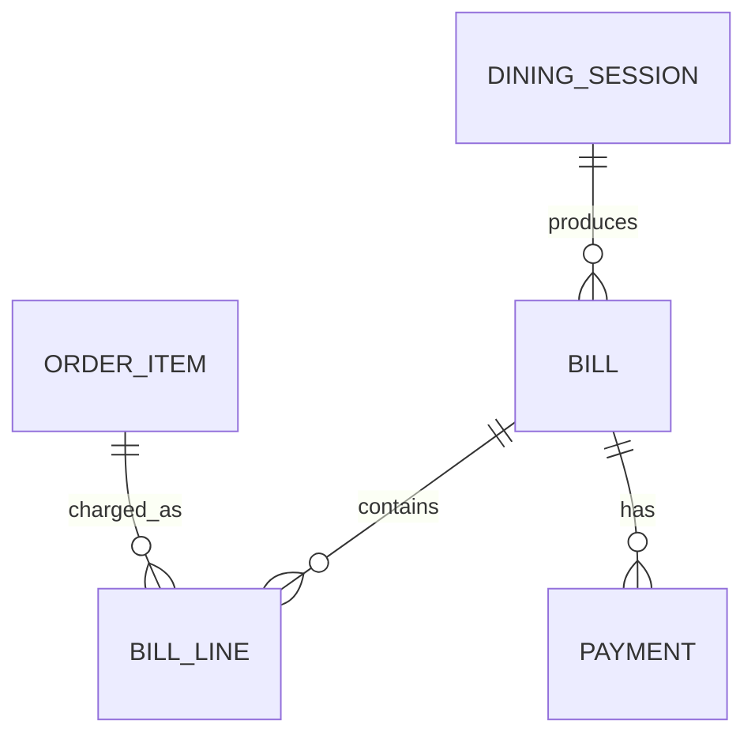

| Bảng | Vai trò | Trường chính |
| --- | --- | --- |
| `bills` | Lưu hóa đơn theo phiên phục vụ | `id`, `sessionId`, `status`, `subtotal`, `total`, `version` |
| `bill_lines` | Lưu từng dòng hóa đơn | `billId`, `orderItemId`, `nameSnapshot`, `quantity`, `amount` |
| `bill_adjustments` | Lưu giảm giá, phụ thu hoặc điều chỉnh | `billId`, `type`, `amount`, `reason`, `actorId` |
| `payments` | Lưu thông tin thanh toán | `id`, `billId`, `method`, `amount`, `status`, `confirmedBy` |

Ràng buộc chính của khối này là một phiên phục vụ chỉ có một hóa đơn đang mở. Hóa đơn chỉ được tạo khi không còn đơn gọi món chờ duyệt, yêu cầu hủy chưa xử lý hoặc tác vụ bếp chưa hoàn tất.

### 3.2.5. Khối đề xuất món

Khối đề xuất món lưu dữ liệu phục vụ thuật toán gợi ý. Dữ liệu trung tâm của khối này là quan hệ giữa phiên phục vụ và món ăn, từ đó hệ thống tạo tín hiệu cho mô hình đề xuất.

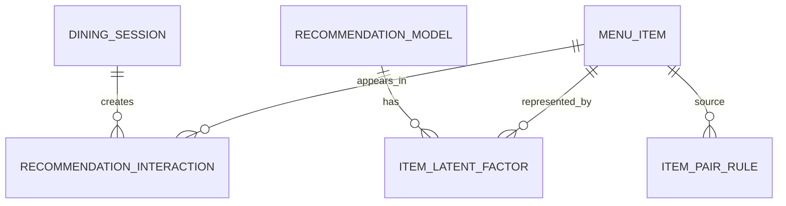

| Bảng | Vai trò | Trường chính |
| --- | --- | --- |
| `recommendation_interactions` | Lưu tương tác giữa phiên phục vụ và món | `sessionId`, `itemId`, `weight`, `source` |
| `recommendation_models` | Lưu thông tin mô hình đề xuất | `id`, `version`, `algorithm`, `factorSize`, `status` |
| `item_latent_factors` | Lưu véc-tơ ẩn của món | `modelId`, `itemId`, `vector`, `bias` |
| `session_latent_factors` | Lưu véc-tơ ẩn của phiên đã huấn luyện | `modelId`, `sessionId`, `vector` |
| `recommendation_events` | Lưu sự kiện hiển thị, bấm xem hoặc thêm món | `sessionId`, `itemId`, `eventType`, `strategy` |
| `item_pair_rules` | Lưu quy tắc món thường đi kèm | `sourceItemId`, `targetItemId`, `weight` |

Một thời điểm chỉ nên có một mô hình đề xuất đang được sử dụng để kết quả gợi ý ổn định. Trước khi trả về món gợi ý, hệ thống vẫn phải kiểm tra trạng thái món trong `menu_items` và `item_availability`.

### 3.2.6. Khối lịch sử thao tác và thông báo

Khối này lưu các sự kiện quan trọng trong quá trình vận hành. Dữ liệu ở đây giúp quản lý kiểm tra lại các thao tác như mở bàn, duyệt đơn, hủy món, thay đổi trạng thái món hoặc xác nhận thanh toán.

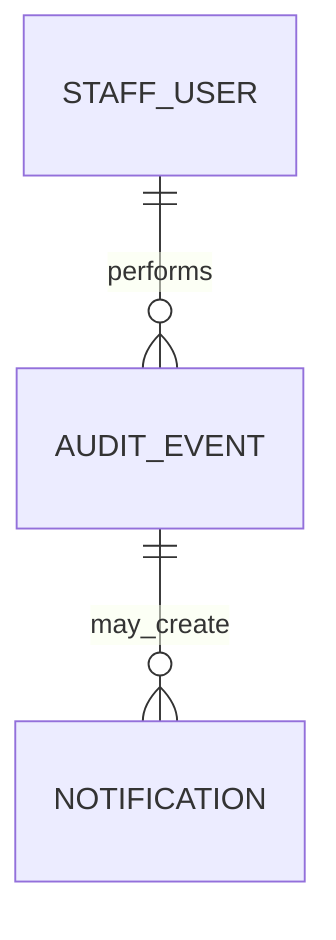

| Bảng | Vai trò | Trường chính |
| --- | --- | --- |
| `audit_events` | Lưu lịch sử thao tác quan trọng | `eventType`, `actorId`, `resourceType`, `resourceId`, `payload` |
| `notifications` | Lưu thông báo phát sinh từ sự kiện nghiệp vụ | `id`, `eventId`, `eventType`, `message` |

Lịch sử thao tác không trực tiếp quyết định nghiệp vụ, nhưng giúp giải thích vì sao dữ liệu thay đổi. Thông báo cũng không phải nguồn dữ liệu chính, mà chỉ là tín hiệu để các màn hình cập nhật trạng thái mới.

Trong chương trình hiện tại, dữ liệu được lưu bằng nhiều tệp văn bản theo từng bảng trong thư mục `data/db/`. Lớp `FileDatabase` chịu trách nhiệm đọc, cập nhật và ghi lại dữ liệu. Các bản ghi nghiệp vụ được khai báo trong `src/domain/models.hpp`. Các phân hệ xử lý nghiệp vụ đọc dữ liệu từ `FileDatabase`, gọi chính sách để kiểm tra điều kiện, sau đó cập nhật trạng thái và ghi lịch sử thao tác nếu cần.

Kiến trúc xử lý được tổ chức theo lớp:

```text
Giao diện dòng lệnh / giao diện Web
-> Bộ tiếp nhận yêu cầu
-> Phân hệ nghiệp vụ
-> Chính sách nghiệp vụ
-> FileDatabase
-> Mô hình dữ liệu
```

Cách tổ chức này giúp tách giao diện khỏi nghiệp vụ. Khi thay đổi giao diện, các quy tắc xử lý chính vẫn nằm ở tầng phân hệ và chính sách, không bị lặp lại trong từng màn hình.

## 3.3. Thuật toán

### 3.3.1. Thuật toán xử lý luồng đặt món

Thuật toán xử lý luồng đặt món mô tả toàn bộ quá trình từ khi nhân viên mở bàn đến khi khách thanh toán. Thuật toán này không được cài đặt như một khối xử lý duy nhất, mà được chia thành nhiều bước tương ứng với các phân hệ nghiệp vụ. Cách chia này giúp mỗi bước có dữ liệu vào, dữ liệu ra và điều kiện kiểm tra rõ ràng.

Đầu vào chính của thuật toán gồm trạng thái bàn, thông tin phiên phục vụ, danh sách món, giỏ món của khách, trạng thái đơn gọi món, trạng thái tác vụ bếp và trạng thái hóa đơn. Đầu ra của thuật toán là một phiên phục vụ hoàn chỉnh, trong đó đơn gọi món được xử lý đúng quy trình, món được chuyển tới bếp hoặc quầy nước, hóa đơn được lập và phiên phục vụ được đóng sau khi thanh toán.

Sơ đồ tổng quát của thuật toán:

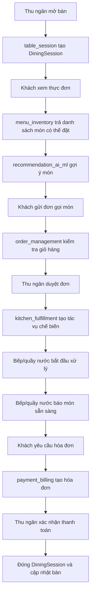

Để trình bày rõ hơn, thuật toán được tách thành năm bước xử lý chính như sau.

**Bước 1. Quản lý bàn và tạo phiên phục vụ**

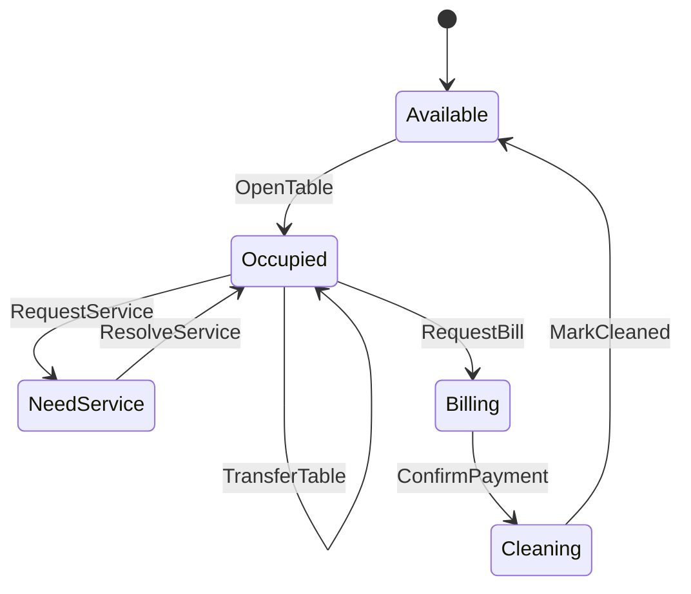

Phân hệ `table_session` bắt đầu khi thu ngân hoặc nhân viên mở bàn. Hệ thống kiểm tra bàn có ở trạng thái `AVAILABLE` hay không, sau đó tạo một `DiningSession` mới và chuyển bàn sang `OCCUPIED`. Trong quá trình phục vụ, phiên ăn có thể ghép bàn, chuyển bàn hoặc phát sinh yêu cầu gọi nhân viên. Khi khách yêu cầu thanh toán, phiên ăn chuyển sang `Billing`; sau khi thanh toán xong, bàn chuyển sang `Cleaning` rồi trở về `Available` sau khi được dọn.

Kết quả của bước này là một phiên phục vụ đang hoạt động. Các bước sau chỉ được thực hiện khi phiên phục vụ hợp lệ.

**Bước 2. Hiển thị thực đơn và lọc món có thể đặt**

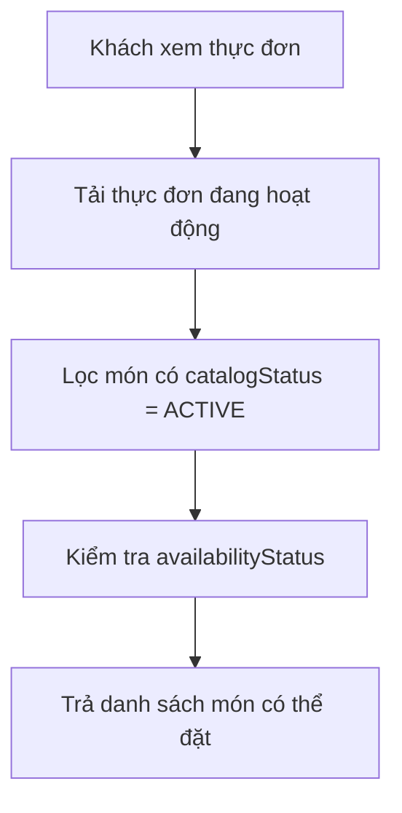

Phân hệ `menu_inventory` là nguồn dữ liệu cho đặt món, bếp, thanh toán và đề xuất. Khi khách xem thực đơn, hệ thống tải thực đơn đang hoạt động, lọc các món thuộc danh mục đang bán, sau đó kiểm tra trạng thái còn/hết để chỉ trả về các món có thể đặt. Việc tách `catalogStatus` và `availabilityStatus` giúp hệ thống phân biệt món thuộc thực đơn với món tạm thời hết trong ngày.

Kết quả của bước này là danh sách món hợp lệ để khách lựa chọn. Danh sách này cũng là nguồn dữ liệu đầu vào cho bước gợi ý món và bước gửi đơn gọi món.

**Bước 3. Gửi và duyệt đơn gọi món**

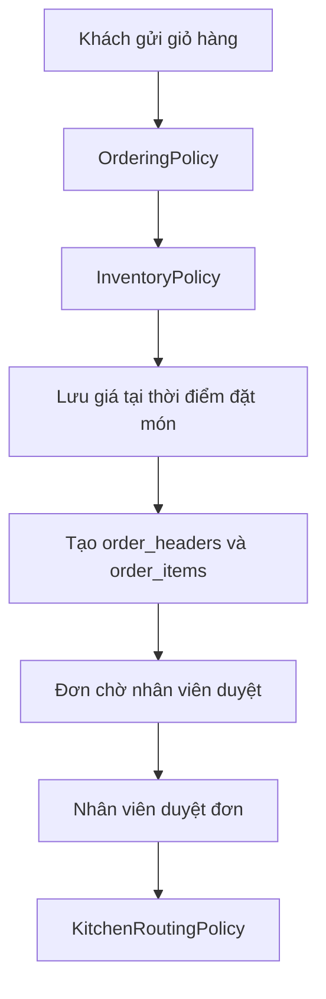

Phân hệ `order_management` xử lý giỏ hàng và đơn gọi món. Khi khách gửi giỏ hàng, `OrderingPolicy` kiểm tra phiên ăn có đang hoạt động không, giỏ hàng có rỗng không và phiên ăn có bị khóa thanh toán không. `InventoryPolicy` kiểm tra lại từng món để tránh đặt món đã hết. Sau đó hệ thống lưu giá tại thời điểm đặt món vào `unitPriceSnapshot`. Đơn gọi món được tạo ở trạng thái chờ duyệt; chỉ khi nhân viên duyệt thì hệ thống mới chuyển sang bước tạo tác vụ chế biến.

Kết quả của bước này là một đơn gọi món đã được duyệt. Những đơn chưa được duyệt sẽ không được chuyển xuống bếp hoặc quầy nước.

**Bước 4. Chuyển đơn gọi món xuống bếp hoặc quầy nước**

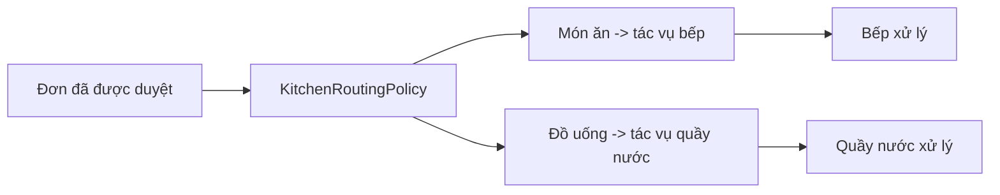

Phân hệ `kitchen_fulfillment` nhận đơn đã được duyệt và tạo tác vụ chế biến. `KitchenRoutingPolicy` quyết định món nào chuyển tới bếp, món nào chuyển tới quầy nước dựa trên nhóm món hoặc quy tắc điều phối. Mỗi tác vụ có trạng thái riêng như `PENDING`, `PREPARING`, `READY`, `SERVED`, `ISSUE` hoặc `CANCELLED`. Nhờ tách `preparation_tasks` và `task_items`, hệ thống có thể theo dõi từng món trong bếp và hỗ trợ các quy tắc như hủy món khi bếp chưa bắt đầu hoặc chặn lập hóa đơn khi còn tác vụ chưa hoàn tất.

Kết quả của bước này là các tác vụ chế biến được tạo và cập nhật theo tiến độ thực tế. Chỉ khi các tác vụ không còn ở trạng thái đang chờ hoặc đang xử lý, hệ thống mới cho phép lập hóa đơn.

**Bước 5. Lập hóa đơn và xác nhận thanh toán**

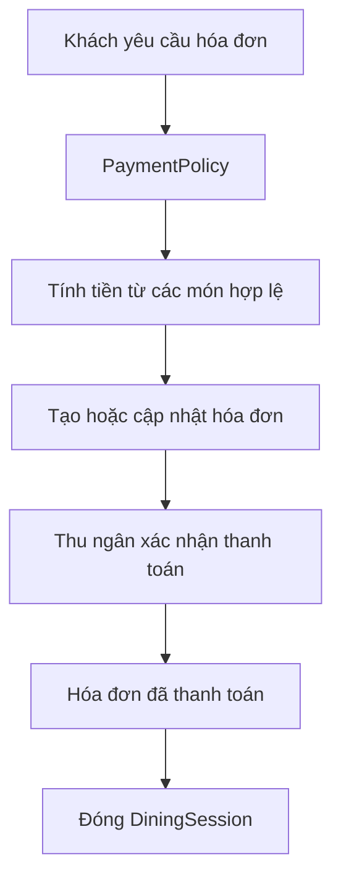

Phân hệ `payment_billing` xử lý thanh toán cuối bữa. Khi khách yêu cầu hóa đơn, `PaymentPolicy` kiểm tra phiên ăn có đủ điều kiện lập hóa đơn hay không. Hệ thống phải bảo đảm không còn đơn gọi món chờ duyệt, tác vụ bếp đang xử lý, sự cố bếp hoặc yêu cầu hủy chưa được giải quyết. Hóa đơn được tính từ các `order_items` hợp lệ, loại bỏ món đã hủy hoặc bị từ chối. Khi thu ngân xác nhận thanh toán, hóa đơn chuyển sang trạng thái đã thanh toán, phiên ăn được đóng và trạng thái bàn được cập nhật.

Như vậy, thuật toán xử lý luồng đặt món có thể xem là một chuỗi chuyển trạng thái có kiểm soát. Chính sách nghiệp vụ được gọi tại các điểm dễ phát sinh sai sót: mở bàn, gửi đơn gọi món, duyệt đơn, chuyển món xuống bếp, yêu cầu hóa đơn và xác nhận thanh toán. Nhờ đó, hệ thống tránh được các trường hợp như gọi món khi bàn chưa mở, đặt món đã hết, chuyển đơn chưa duyệt xuống bếp hoặc thanh toán khi vẫn còn món đang chế biến.

### 3.3.2. Thuật toán đề xuất món

Quy trình tổng quát của thuật toán đề xuất món:

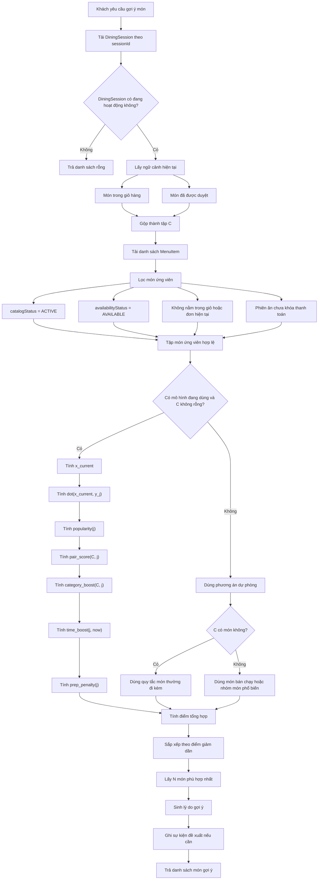

Thuật toán bắt đầu khi khách yêu cầu xem món gợi ý. Hệ thống chỉ xử lý nếu `DiningSession` đang hoạt động. Ngữ cảnh `C` gồm các món trong giỏ hàng và các món đã được nhân viên duyệt. Trước khi chấm điểm, tập món ứng viên được lọc để bảo đảm không đề xuất món hết, món không hoạt động hoặc món đã gọi. Nếu có mô hình đang dùng và có ngữ cảnh hợp lệ, hệ thống dùng thuật toán đề xuất lai; nếu chưa đủ dữ liệu, hệ thống chuyển sang phương án dự phòng theo món thường đi kèm hoặc món bán chạy. Kết quả cuối cùng là N món có điểm cao nhất, kèm lý do gợi ý.

Với mỗi món ứng viên `j`, điểm tổng hợp được tính như sau:

$$
\begin{aligned}
\operatorname{score}(j)
=\;& w_{lf}\,x_{\text{current}}^{T}y_j
+ w_{pop}\,\operatorname{popularity}(j) \\
&+ w_{pair}\,\operatorname{pair\_score}(C,j)
+ w_{cat}\,\operatorname{category\_boost}(C,j) \\
&+ w_{time}\,\operatorname{time\_boost}(j,\text{now})
- w_{prep}\,\operatorname{prep\_penalty}(j) \\
&- w_{dup}\,\operatorname{duplicate\_penalty}(C,j)
\end{aligned}
$$

Các trọng số ban đầu có thể chọn:

$$
w_{lf}=0.45,\quad
w_{pop}=0.20,\quad
w_{pair}=0.20,\quad
w_{cat}=0.10,\quad
w_{time}=0.05,\quad
w_{prep}=0.05
$$

Trong đó \(w_{dup}\) được chọn đủ lớn để loại bỏ các món đã xuất hiện trong ngữ cảnh hiện tại.

Độ phổ biến được chuẩn hóa bằng log để món quá phổ biến không áp đảo toàn bộ danh sách:

$$
\operatorname{popularity}(j)
=
\frac{\log(1+\operatorname{served\_count}_j)}
{\log(1+\operatorname{max\_served\_count})}
$$

Điểm món thường đi kèm dựa trên số phiên ăn đã gọi cả hai món:

$$
\operatorname{confidence}(i \rightarrow j)
=
\frac{\operatorname{cooc}(i,j)}{\operatorname{support}(i)}
$$

$$
\operatorname{lift}(i,j)
=
\frac{\operatorname{confidence}(i \rightarrow j)}
{\operatorname{support}(j)/\operatorname{total\_sessions}}
$$

$$
\operatorname{pair\_score}(C,j)
=
\max_{i \in C}
\left[
\log(1+\operatorname{cooc}(i,j)) \cdot \operatorname{lift}(i,j)
\right]
$$

Thuật toán có thể được biểu diễn bằng mã giả:

```text
de_xuat_mon(sessionId, soLuong):
    phien = tai_phien_phuc_vu(sessionId)
    neu phien.status != ACTIVE:
        tra_ve []

    C = mon_trong_gio(phien) + mon_da_duyet(phien)
    ung_vien = danh_sach_mon_active_available()
    ung_vien = ung_vien - C

    neu co_mo_hinh_dang_dung va C khong rong:
        x_current = trung_binh_co_trong_so(vector_mon[i] voi i trong C)
        voi moi mon trong ung_vien:
            diem[mon] = tinh_diem_tong_hop(x_current, C, mon)
    nguoc_lai:
        voi moi mon trong ung_vien:
            diem[mon] = tinh_diem_du_phong(C, mon)

    sap_xep ung_vien theo diem giam dan
    tra_ve soLuong mon dau tien kem ly_do_goi_y
```

Hệ thống cũng sinh lý do gợi ý để kết quả dễ hiểu hơn:

- Nếu `pair_score` cao: "Thường được gọi cùng món bạn đã chọn".
- Nếu `category_boost` cao: "Bàn chưa có đồ uống/tráng miệng".
- Nếu `popularity` cao: "Món được nhiều bàn gọi".
- Nếu dùng phương án dự phòng: "Gợi ý phổ biến hôm nay".

### 3.3.3. Độ phức tạp

Giả sử \(M\) là số món trong thực đơn, \(C\) là số món trong ngữ cảnh hiện tại, \(k\) là số chiều của véc-tơ ẩn. Bước lọc món ứng viên có độ phức tạp \(O(M)\). Nếu dùng nhân tử ẩn, phép nhân vô hướng giữa \(x_{\text{current}}\) và từng véc-tơ món có độ phức tạp \(O(Mk)\). Nếu tính điểm món thường đi kèm trực tiếp với từng món trong ngữ cảnh, chi phí là \(O(MC)\). Bước sắp xếp danh sách ứng viên có độ phức tạp \(O(M \log M)\).

Với quy mô thực đơn của một nhà hàng phục vụ tại bàn, các bước trên phù hợp để cài đặt bằng C++ và lưu trữ dữ liệu bằng tệp. Khi dữ liệu lớn hơn, có thể tối ưu bằng cách lưu sẵn các cặp món thường đi kèm, dùng cấu trúc heap để lấy N món tốt nhất hoặc lưu tạm điểm phổ biến theo ngày.

# 4. CHƯƠNG TRÌNH VÀ KẾT QUẢ

## 4.1. Tổ chức chương trình

Chương trình được tổ chức theo cấu trúc thư mục:

```text
src/
  domain/                 Mô hình dữ liệu dùng chung
  shared/                 Tiện ích chung
  infrastructure/         Lưu trữ dữ liệu bằng tệp
  policies/               Chính sách nghiệp vụ
  modules/
    table_session/        Mở bàn, ghép bàn, chuyển bàn
    menu_inventory/       Thực đơn và trạng thái món
    order_management/     Gửi, duyệt, từ chối, hủy món
    kitchen_fulfillment/  Tác vụ bếp và quầy nước
    payment_billing/      Hóa đơn và thanh toán
    recommendation_ai_ml/ Đề xuất món
    reporting_audit/      Báo cáo và lịch sử thao tác
  console/                Giao diện dòng lệnh theo vai trò
  server/                 Máy chủ C++ và API
web/                      Giao diện HTML/CSS/JavaScript
scripts/                  Tập lệnh build, chạy thử và khởi tạo dữ liệu
data/db/                  Dữ liệu dạng tệp
```

Tệp `main.cpp` chọn chế độ chạy như thu ngân, khách tại bàn, bếp, quản lý, máy chủ, kiểm thử hoặc khởi tạo lại dữ liệu. Các phân hệ nghiệp vụ không phụ thuộc trực tiếp vào giao diện, nhờ đó cùng một logic xử lý có thể được gọi từ giao diện dòng lệnh hoặc từ API.

Phân hệ đề xuất món đặt tại `src/modules/recommendation_ai_ml/`. Chương trình sử dụng véc-tơ đặc trưng món và điểm số tổng hợp để mô phỏng hướng đề xuất theo nhân tử ẩn. Nếu phiên ăn chưa có đủ tín hiệu, hệ thống dùng phương án dự phòng theo số lượng đã bán và nhóm món phù hợp.

## 4.2. Ngôn ngữ cài đặt

Các công nghệ sử dụng:

- C++17: cài đặt xử lý nghiệp vụ, thuật toán, chính sách, lưu trữ dữ liệu, giao diện dòng lệnh và máy chủ.
- CMake: cấu hình và biên dịch chương trình.
- HTML/CSS/JavaScript thuần: xây dựng giao diện Web cho khách, thu ngân, bếp/quầy nước và quản lý.
- Tệp `.txt`: lưu trữ dữ liệu theo từng bảng trong thư mục `data/db/`.
- Tập lệnh `.bat`: hỗ trợ biên dịch, chạy các vai trò và khởi tạo lại dữ liệu.

C++17 được lựa chọn vì phù hợp với môn Lập trình tính toán, dễ biểu diễn cấu trúc dữ liệu và thuật toán, đồng thời không phụ thuộc vào thư viện nặng. Cơ chế lưu trữ bằng tệp giúp chương trình dễ chạy trong môi trường học phần. Với hướng phát triển tiếp theo, cơ chế này có thể được thay bằng SQLite hoặc PostgreSQL để hỗ trợ giao dịch và khóa dữ liệu tốt hơn.

## 4.3. Kết quả

### 4.3.1. Giao diện chính của chương trình

Chương trình hỗ trợ hai cách tương tác: giao diện dòng lệnh và giao diện Web.

Với giao diện dòng lệnh, mỗi vai trò chạy ở một cửa sổ riêng:

- `cashier`: mở bàn, duyệt đơn gọi món, xử lý hủy món, lập hóa đơn và xác nhận thanh toán.
- `customer T01`: khách tại bàn T01 xem thực đơn, xem gợi ý, thêm món, gửi đơn gọi món và yêu cầu thanh toán.
- `kitchen kitchen`: bếp nhận tác vụ món ăn, bắt đầu làm món và đánh dấu món sẵn sàng.
- `kitchen bar`: quầy nước nhận tác vụ đồ uống.
- `manager`: quản lý trạng thái món, xem doanh thu và xem lịch sử thao tác.

Với giao diện Web, các màn hình chính gồm:

- `index.html`: trang điều hướng.
- `customer.html?table=T01`: giao diện khách hàng theo bàn.
- `cashier.html`: giao diện thu ngân.
- `kitchen.html?station=kitchen`: giao diện bếp.
- `kitchen.html?station=bar`: giao diện quầy nước.
- `manager.html`: giao diện quản lý.

Giao diện chỉ gửi yêu cầu đến chương trình xử lý và hiển thị kết quả. Các quyết định nghiệp vụ như món có được đặt không, đơn có được duyệt không, hóa đơn có được tạo không đều do các phân hệ xử lý nghiệp vụ và chính sách quyết định.

### 4.3.2. Kết quả thực thi của chương trình

Kịch bản thực thi chính:

```text
1. Khởi tạo dữ liệu ban đầu.
2. Thu ngân mở bàn T01.
3. Khách tại bàn T01 xem thực đơn.
4. Khách xem danh sách món được đề xuất.
5. Khách thêm món vào giỏ và gửi đơn gọi món.
6. Thu ngân nhận đơn mới và duyệt đơn.
7. Bếp hoặc quầy nước nhận tác vụ, bắt đầu xử lý và báo món sẵn sàng.
8. Khách yêu cầu hóa đơn.
9. Thu ngân lập hóa đơn và xác nhận thanh toán.
10. Phiên phục vụ được đóng, bàn chuyển sang trạng thái cần dọn hoặc sẵn sàng phục vụ.
```

Các kết quả đạt được:

- Hệ thống mở phiên phục vụ tại bàn và cập nhật trạng thái bàn.
- Thực đơn chỉ hiển thị các món hợp lệ theo trạng thái còn/hết.
- Khách có thể gửi đơn gọi món và nhân viên duyệt trước khi chuyển xuống bếp.
- Tác vụ được tách theo bếp hoặc quầy nước.
- Hóa đơn cuối bữa loại bỏ các món đã hủy hoặc bị từ chối.
- Thu ngân hoặc quản lý xác nhận thanh toán.
- Hệ thống trả về danh sách món gợi ý phù hợp với phiên ăn.
- Lịch sử thao tác ghi nhận các hành động quan trọng.

### 4.3.3. Nhận xét đánh giá

Về mặt nghiệp vụ, hệ thống thể hiện được quy trình đặt món từ lúc mở bàn đến lúc thanh toán. Việc tách hệ thống thành các phân hệ giúp cấu trúc chương trình rõ ràng, dễ kiểm tra và dễ mở rộng. Các chính sách nghiệp vụ giúp hạn chế việc viết điều kiện xử lý trực tiếp trong giao diện.

Về mặt thuật toán, hướng đề xuất dựa trên `DiningSession x MenuItem` phù hợp với nhà hàng không yêu cầu tài khoản khách hàng. Thuật toán tận dụng được lịch sử gọi món, món trong giỏ hiện tại, món thường đi kèm và trạng thái còn/hết của món. Khi dữ liệu chưa đủ, hệ thống vẫn có thể dùng phương án dự phòng theo món bán chạy hoặc nhóm món phù hợp.

Về mặt dữ liệu, cơ chế lưu trữ bằng tệp giúp chương trình dễ chạy trong phạm vi đồ án. Tuy nhiên, nếu phát triển thành hệ thống sử dụng thực tế, cần thay bằng hệ quản trị cơ sở dữ liệu để hỗ trợ giao dịch, khóa dữ liệu, truy vấn báo cáo và kiểm soát đồng thời tốt hơn.

Về mặt giao diện, giao diện dòng lệnh phù hợp để kiểm tra nghiệp vụ và thuật toán, còn giao diện Web giúp mô phỏng trải nghiệm sử dụng gần thực tế hơn. Các phần có thể tiếp tục hoàn thiện gồm phân quyền chi tiết, thông báo thời gian thực, giao diện xử lý sự cố bếp và giao diện giải thích kết quả đề xuất.

# 5. KẾT LUẬN VÀ HƯỚNG PHÁT TRIỂN

## 5.1. Kết luận

Đề tài đã xây dựng được một ứng dụng hỗ trợ quy trình đặt món trong nhà hàng phục vụ tại bàn. Hệ thống mô hình hóa được bàn, phiên phục vụ, thực đơn, đơn gọi món, bếp, hóa đơn, lịch sử thao tác và chức năng đề xuất món. Các phân hệ được tổ chức rõ ràng, chương trình được cài đặt bằng C++17, dữ liệu được lưu bằng tệp và giao diện có cả dòng lệnh lẫn Web.

Thuật toán đề xuất được phân tích theo hướng gợi ý lai trên dữ liệu `DiningSession x MenuItem`. Mô hình kết hợp nhân tử ẩn, độ phổ biến, món thường đi kèm, nhóm món, thời điểm và phương án dự phòng. Cách tiếp cận này phù hợp với nhà hàng vì không cần tài khoản khách hàng nhưng vẫn khai thác được lịch sử gọi món.

Kết quả chương trình cho thấy hệ thống có thể chạy được luồng chính: mở bàn, xem thực đơn, gợi ý món, gửi đơn gọi món, duyệt đơn, xử lý bếp, lập hóa đơn và thanh toán. Đây là cơ sở để tiếp tục hoàn thiện thành một hệ thống quản lý đặt món có khả năng áp dụng thực tế.

## 5.2. Hướng phát triển

Các hướng phát triển tiếp theo:

- Hoàn thiện quá trình huấn luyện mô hình nhân tử ẩn, lưu `recommendation_models`, `item_latent_factors`, `session_latent_factors` và `recommendation_interactions`.
- Bổ sung các chỉ số đánh giá như Precision@K, Recall@K, HitRate@K và Coverage.
- Chuẩn hóa `PolicyDecision` gồm mã lỗi, thông báo, hành động cần thực hiện, ngữ cảnh, yêu cầu ghi lịch sử và đối tượng nhận thông báo.
- Nâng cấp cơ chế lưu trữ từ tệp `.txt` sang SQLite hoặc PostgreSQL.
- Hoàn thiện phân quyền cho quản lý, thu ngân, nhân viên phục vụ, bếp và khách hàng.
- Bổ sung quy trình xử lý sự cố bếp, trạng thái đã giao món, phiên bản hóa đơn và kiểm tra số tiền thanh toán.
- Nâng cấp giao diện Web để hiển thị danh sách điều kiện chặn, quyết định của khách khi món hết và thông báo thời gian thực.
- Tích hợp máy in bếp, cổng thanh toán và báo cáo quản trị nâng cao khi mở rộng ngoài phạm vi đồ án.

# TÀI LIỆU THAM KHẢO

1. G. Adomavicius, A. Tuzhilin, "Toward the Next Generation of Recommender Systems: A Survey of the State-of-the-Art and Possible Extensions", IEEE Transactions on Knowledge and Data Engineering, 2005.
2. F. Ricci, L. Rokach, B. Shapira, *Recommender Systems Handbook*, Springer, 2022.
3. C. C. Aggarwal, *Recommender Systems: The Textbook*, Springer, 2016.
4. M. J. Pazzani, D. Billsus, "Content-Based Recommendation Systems", trong *The Adaptive Web*, Springer, 2007.
5. B. Sarwar, G. Karypis, J. Konstan, J. Riedl, "Item-Based Collaborative Filtering Recommendation Algorithms", Proceedings of the 10th International Conference on World Wide Web, 2001.
6. Y. Hu, Y. Koren, C. Volinsky, "Collaborative Filtering for Implicit Feedback Datasets", IEEE International Conference on Data Mining, 2008.
7. Y. Koren, R. Bell, C. Volinsky, "Matrix Factorization Techniques for Recommender Systems", Computer, 2009.
8. S. Rendle, C. Freudenthaler, Z. Gantner, L. Schmidt-Thieme, "BPR: Bayesian Personalized Ranking from Implicit Feedback", Proceedings of UAI, 2009.

# PHỤ LỤC

## Phụ lục A. Tài liệu tham khảo cho phân hệ đề xuất

| Tài liệu | Nội dung tham khảo trong báo cáo | Đường dẫn |
| --- | --- | --- |
| Adomavicius và Tuzhilin, 2005 | Phân loại các hướng tiếp cận chính của hệ gợi ý: dựa trên nội dung, lọc cộng tác và gợi ý lai | https://ieeexplore.ieee.org/document/1423975 |
| Ricci, Rokach và Shapira, 2022 | Khái niệm tổng quan về hệ gợi ý và các thành phần thường gặp | https://link.springer.com/book/10.1007/978-1-0716-2197-4 |
| Aggarwal, 2016 | Cơ sở lý thuyết về dữ liệu người dùng - sản phẩm, đánh giá hệ gợi ý và các kỹ thuật gợi ý phổ biến | https://link.springer.com/book/10.1007/978-3-319-29659-3 |
| Pazzani và Billsus, 2007 | Cơ sở của gợi ý dựa trên nội dung, phù hợp khi món ăn có đặc trưng như nhóm món, giá, thời gian chuẩn bị | https://link.springer.com/chapter/10.1007/978-3-540-72079-9_10 |
| Sarwar và cộng sự, 2001 | Ý tưởng lọc cộng tác dựa trên độ tương đồng giữa các món | https://files.grouplens.org/papers/www10_sarwar.pdf |
| Hu, Koren và Volinsky, 2008 | Cách xử lý dữ liệu phản hồi ngầm như hành vi gọi món, bấm xem hoặc thêm vào giỏ | https://yifanhu.net/PUB/cf.pdf |
| Koren, Bell và Volinsky, 2009 | Cơ sở của mô hình nhân tử ẩn và phân rã ma trận trong hệ gợi ý | https://ieeexplore.ieee.org/document/5197422 |
| Rendle và cộng sự, 2009 | Hướng tối ưu xếp hạng từ dữ liệu phản hồi ngầm | https://arxiv.org/abs/1205.2618 |

## Phụ lục B. Bảng thuật ngữ sử dụng trong báo cáo

| Thuật ngữ | Ý nghĩa |
| --- | --- |
| `DiningSession` | Phiên phục vụ của một lượt khách tại bàn hoặc nhóm bàn |
| `MenuItem` | Món ăn hoặc đồ uống trong thực đơn |
| `OrderItem` | Một món cụ thể trong đơn gọi món |
| `Bill` | Hóa đơn thanh toán cuối phiên phục vụ |
| `Recommendation` | Kết quả gợi ý món cho khách |
| Lọc cộng tác | Hướng đề xuất dựa trên hành vi của nhiều người dùng hoặc nhiều phiên phục vụ |
| Gợi ý dựa trên nội dung | Hướng đề xuất dựa trên đặc trưng của đối tượng, ví dụ nhóm món, giá, thời gian chuẩn bị |
| Nhân tử ẩn | Véc-tơ ẩn biểu diễn khẩu vị của phiên phục vụ và đặc trưng của món |
| Phản hồi ngầm | Dữ liệu hành vi như gọi món, bấm xem, thêm vào giỏ thay cho đánh giá sao |

## Phụ lục C. Mã giả thuật toán đề xuất món

```text
de_xuat_mon(sessionId, soLuong):
    phien = tai_phien_phuc_vu(sessionId)
    neu phien.status != ACTIVE:
        tra_ve []

    C = mon_trong_gio(phien) + mon_da_duyet(phien)
    ung_vien = danh_sach_mon_active_available()
    ung_vien = ung_vien - C

    neu co_mo_hinh_dang_dung va C khong rong:
        x_current = trung_binh_co_trong_so(vector_mon[i] voi i trong C)
        voi moi mon trong ung_vien:
            diem[mon] = tinh_diem_tong_hop(x_current, C, mon)
            ly_do[mon] = giai_thich_thanh_phan_diem(mon)
    nguoc_lai:
        voi moi mon trong ung_vien:
            diem[mon] = tinh_diem_du_phong(C, mon)
            ly_do[mon] = giai_thich_du_phong(mon)

    sap_xep ung_vien theo diem giam dan
    tra_ve soLuong mon dau tien kem ly_do
```
